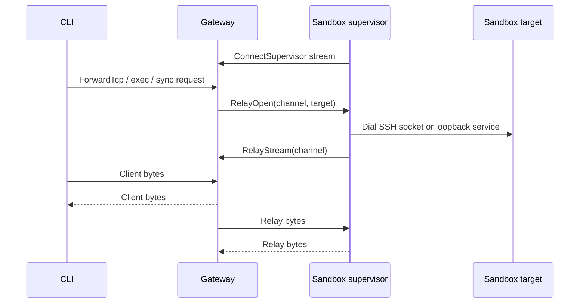

# Gateway

The gateway is the OpenShell control plane. It exposes the API used by the CLI,
SDK, and TUI; persists platform state; manages provider credentials and
attachments; and asks compute runtimes to create or delete sandbox workloads.

## Responsibilities

- Authenticate clients and sandbox callbacks.
- Serve gRPC APIs for sandbox lifecycle, provider management, policy updates,
  settings, logs, watch streams, and relay forwarding.
- Serve HTTP endpoints for health, WebSocket tunnels, and edge-auth flows.
- Persist domain objects in SQLite or Postgres.
- Resolve endpoint-bound provider environments for sandbox supervisors.
- Coordinate supervisor relay sessions for connect, exec, file sync, and
  service forwarding.
- Persist the canonical main-process instance ID and normalized exit code on
  sandbox status. Exit code zero transitions the sandbox to `Completed`;
  nonzero results transition it to `Error/MainProcessFailed`. Infrastructure
  failures also use `Error`, with a distinct reason and no fabricated command
  result.

The isolated supervisor enforces agent network policy at request time using process identity from the workload boundary. The gateway stores and delivers the effective configuration.

The live supervisor session identifies the current main-process instance. Readiness also requires matching accepted configuration and confirmed activation for that control and boundary incarnation; a session or driver-ready observation alone is insufficient.

The supervisor reports its normalized result through the sandbox-authenticated `ReportMainProcessExit` RPC, and the gateway rejects results from stale instance IDs. Foreground creation carries a one-shot attachment intent to the process supervisor. The supervisor durably reports the result immediately, accepts that declared SSH attachment even when the process has already exited, sends the retained output and exit status, and waits for the peer's channel close before finalizing the result for ephemeral cleanup. Detached commands carry no attachment intent, so they finalize and exit immediately without a grace period. Finalization is persisted separately from the exit result; the gateway deletes an ephemeral sandbox only after the finalized supervisor session disconnects.

## Configuration Boundary

The gateway accepts exactly schema version 2. Missing, legacy, and future
versions fail before runtime construction, and driver settings belong only to
`[openshell.drivers.<name>]`. The process does not migrate legacy files.
Package lifecycle code may replace an exact package-generated v1 default, but
it preserves edited configurations for explicit operator migration.

Gateway listener TLS and sandbox callback TLS are separate inputs. A selected
local Docker, Podman, or VM driver requires a complete guest bundle whenever
the gateway listener uses TLS; package-managed local TLS can supply that bundle.
Kubernetes instead projects guest credentials through its configured Secret.
The gateway validates this requirement before constructing the selected driver.

### Effective configuration admission

The gateway stores the desired delivered snapshot separately from the accepted installation in sandbox status. A registered control poll issues an immutable snapshot/token covering the selected policy, runtime settings and provider revision. Provider fetches must match that revision. New provider/global changes become desired at the next authoritative poll; ordinary CLI reads do not issue generations or establish runtime acceptance.

Pending registration uses compare-and-swap against the current control/boundary pair. The gateway signs a registration grant bound to the sandbox, driver runtime generation, authentication epoch, control instance, boundary session/incarnation and monotonic registration revision. This permits a replacement control to take over a surviving boundary while fencing old grants and reports. A destroyed boundary requires a new driver runtime generation.

The supervisor reports a committed but still frozen installation first. Acceptance compares the full delivered snapshot and registered runtime identity, then durably authorizes release. The first authorization consumes the never-activated repair marker before the workload may run. A subsequent matching `activation_confirmed` report proves release and updates loaded policy history; accepted state without that confirmation cannot establish readiness.

Rejected initial configurations use a repairable configuration condition while runtime authentication remains available. Static policy repair requires a positive never-authorized marker and pending/rejected admission. Stale rejection, legacy loaded reports, and driver-ready observations cannot replace accepted activation. See [sandbox activation](sandbox.md#configuration-activation-and-policy-acknowledgement) for the control/boundary sequence.

## Protocol and Auth

Gateway validation and concurrency errors use the standard rich gRPC error
envelope. Shared field validators attach `google.rpc.BadRequest`, and conditional
write conflicts attach `google.rpc.ErrorInfo` with a stable reason and current
version when available. `google.rpc.RetryInfo` expresses a minimum retry delay;
it does not establish that a mutation is safe to repeat. SDKs retain the original
transport status, metadata, and unknown details alongside decoded fields.
SDK deletion waits recognize missing-resource status through typed error wrappers
without suppressing other failures.

The gateway listens on one service port and multiplexes gRPC and HTTP traffic.
The default local single-user deployment mode is mTLS user authentication:
clients present a certificate signed by the local deployment CA, and the
gateway maps the verified certificate subject to a user principal. Kubernetes
deployments use mTLS for transport only and require OIDC or a trusted access
proxy for user authentication unless the explicit unsafe local-development
`allow_unauthenticated_users` switch is enabled.
When that service port is bound to loopback, the listener can also accept
plaintext HTTP on the same port for sandbox service subdomains only. That local
browser path is enabled by default and disabled with
`--enable-loopback-service-http=false`; it never serves gateway APIs, auth,
health, metrics, or tunnel routes. The plaintext service router also rejects
browser requests whose Fetch Metadata, Origin, or Referer headers indicate a
cross-origin or sibling-subdomain request.

Public workspace-scoped RPCs carry a typed `WorkspaceSelector`. A request must
select one non-empty workspace explicitly; `default` is an ordinary explicit
name, not an omitted-value fallback. Sandbox, sandbox template, provider, and
service list RPCs also accept an all-workspaces marker after Platform Admin
authorization. Single-workspace handlers reject that marker. Platform-global
policy operations require the selector to be absent, while workspace policy
operations require it. The gateway authorizes the selected scope before
performing resource lookup so malformed, unsupported, and unauthorized scopes
have consistent behavior across resource types.

Docker and Podman report the local address through which their sandboxes can
reach the gateway. When the primary listener covers that address, the gateway
reuses it; sandbox JWT authentication and its RPC allowlist remain the callback
authorization boundary. When the primary listener does not cover the address,
the gateway adds a callback-only listener. Additional callback listeners accept
only gRPC methods classified as sandbox-callable by the gateway's generated
authorization metadata. They reject user and administrator APIs, health,
reflection, and HTTP routes before normal request
authentication. The operator-configured primary listener retains the full
multiplexed API surface.

The `rpc_auth` classification is also the source of truth for negotiated
listener exposure: marking an RPC as `sandbox` or `dual` makes it callable on
these listeners. Review such changes as both authorization and network-surface
changes. Listener requirements are currently authorized only for the built-in
Docker and Podman drivers. Operator-granted listener capabilities for external
drivers are tracked in
[#2539](https://github.com/NVIDIA/OpenShell/issues/2539).

Operators can configure a gateway-wide gRPC request rate limit. The limit is
applied only to gRPC API traffic after protocol multiplexing; health, metrics,
and local sandbox-service HTTP routes are not rate limited by this control.

Gateway interceptors run in one middleware layer on the `openshell.v1.OpenShell`
gRPC service after authentication and before tonic dispatches to individual
handlers. At startup the gateway calls each configured interceptor's `Describe`
RPC, validates declared bindings against the compiled OpenShell descriptor set,
and builds an immutable execution plan. Only unary OpenShell methods in the
gateway's explicit interceptable-method allowlist are decoded through the
descriptor set into protobuf JSON, evaluated through configured phases, and
re-encoded before the handler sees the request. New RPCs are non-interceptable
until deliberately added to this allowlist. Interception remains centralized:
allowlisting a unary RPC does not require method-specific gateway
instrumentation.

Remote extension clients share `openshell-extension-core` transport and bearer
primitives. When gateway JWT signing is configured, the gateway mints
short-lived, exact-audience EdDSA credentials for middleware and interceptors,
rotates their in-memory slots without rebuilding clients, and publishes the
public verification key at `/.well-known/jwks.json` alongside OIDC-shaped
discovery metadata at `/.well-known/openid-configuration`. HTTPS extensions can
pin an operator-provided CA while retaining endpoint-hostname verification.

Extension credentials reuse the sandbox signing key and are separated from
sandbox-to-gateway admission tokens by exact audience and by an explicit
`typ` of `openshell-ext+jwt`, so a verifier that checks either one alone
cannot confuse the two. After authenticated `Describe` succeeds, a service may
advertise `expected_audience` as a post-authentication consistency assertion;
a mismatch against operator configuration fails gateway startup. A strict
verifier may reject an incorrect audience before returning the manifest. A
registration may opt out of extension authentication entirely with
`allow_insecure_transport`, which permits a plaintext endpoint, attaches no
credential, and warns at every startup. Credential minting is bounded per
sandbox because it resolves the caller's effective policy.

Each configured interceptor selects a binding policy. `dynamic` accepts valid
manifest declarations and preserves the compatibility behavior. `allowlist`
enables only operator-configured RPCs and phases, while `exact` requires the
configured and declared sets to match. Strict policies match by RPC rather than
manifest binding ID, so renaming a binding does not change authority. Provider
profile sources remain a separate operator-controlled capability.

The protobuf schema marks dedicated credential, token, and refresh-material
fields with a custom secret option. The middleware recursively omits those
fields from every request and post-commit response sent to an interceptor while
retaining the complete protobuf operation for handler dispatch. JSON Patch
paths and source paths cannot select an omitted field or replace a containing
object. There is no configuration that exposes annotated fields.

`SubmitPolicyAnalysis` is interceptable because proposed chunks can eventually
change active policy through the gateway's approval workflow. An interceptor
may therefore reject policy proposals while permitting telemetry-only requests.
Gateways without a matching binding retain the standard proposal behavior.

The descriptor codec uses protobuf's standard `oneof` semantics. If binary
input contains multiple alternatives from one group, the last member on the
wire wins. The middleware converts that selected value to ProtoJSON and
re-encodes it before dispatch, so the interceptor and handler observe the same
canonical request. ProtoJSON input that names multiple alternatives remains
invalid.

Modification results are atomic per binding. After applying one binding's full
JSON Patch list, the middleware re-encodes the candidate as the request's
protobuf type and decodes those accepted bytes back to canonical ProtoJSON.
Invalid candidates follow that binding's failure policy: fail-open restores the
exact pre-binding operation, while fail-closed rejects the request before
handler dispatch. Later bindings only observe the same schema-valid operation
that the handler will receive; protobuf map entry ordering is not treated as a
semantic difference.

Each interceptor evaluation selects exactly one phase payload:
`modify_operation`, `validate`, or `post_commit`. Modification and validation
payloads carry the protobuf JSON operation entering that phase. Post-commit
payloads carry the successful committed response instead of echoing the
request. Only the `validate` payload can also carry optional read-only
`current_state`; modification and post-commit evaluations never receive it. The
gateway does not yet load method-specific state, so the field remains absent;
an absent state is distinct from an explicitly empty object. Method-specific
state schemas and persistence-version binding are deferred until a concrete
consumer requires them.

Post-commit evaluation is strictly observational. A binding that includes
`post_commit` must resolve to `fail_open`, or interceptor initialization fails.
After a handler returns success, failures never replace the committed response.
Binding failures emit the standard fail-open warning and counter; response
observation or evaluation failures outside binding policy emit warnings and the
`openshell_gateway_interceptor_post_commit_observation_failures_total` metric.
The gateway reconstructs the original response frames, including trailers and
body errors, before evaluating the observer.

Interceptor manifests can also vend provider profile catalogs. Gateway
configuration selects the exact ordered source set from the in-tree built-in
source, the stored user source, and named profile-capable interceptors. Omitting
the setting selects `builtin + user`; selecting only an interceptor makes it
authoritative by omission. Every selected source uses the same snapshot,
semantic-validation, and duplicate-detection path. Duplicate normalized profile
IDs fail instead of creating source precedence. The gateway treats configured
interceptors as trusted sources and does not verify signature annotations in
their profile payloads.

Each logical gateway request captures the selected sources into one validated,
immutable effective catalog before deriving provider behavior. Policy layers,
credential scope, injected environment material, dynamic token grants, and
provider-environment revisions use that same catalog. Each configured source is
therefore fetched at most once per request, and a source revision change becomes
visible on the next request instead of partway through the current request. The
capture emits debug diagnostics with the combined catalog revision, source fetch
count, and profile count; it never logs provider credentials or profile material.

Supported auth modes:

| Mode | Use |
|---|---|
| mTLS user auth | Local single-user Docker, Podman, and VM gateway access. |
| Plaintext | Local development or a trusted reverse proxy boundary. |
| Unauthenticated local users | Trusted Kubernetes dev or fully trusted proxy deployments only. |
| Cloudflare JWT | Edge-authenticated deployments where Cloudflare Access supplies identity. |
| OIDC | Bearer-token auth for users, with browser or device-code PKCE and client credentials login. Discovery and JWKS retrieval require HTTPS, reject redirects, and pin JWKS to the issuer origin or an explicit origin allowlist. JWKS validation accepts RS256, RS384, RS512, PS256, PS384, PS512, ES256, ES384, and EdDSA (Ed25519) signing keys. |

The CLI persists the scopes requested during OIDC login in gateway metadata and
reuses them when refreshing an access token. This preserves the intended API
resource selection for identity providers that bind access-token audiences to
OAuth scopes.

Python and Go SDK client-credentials providers can use the same registered
issuer, client ID, audience, and scope metadata; the TypeScript provider accepts
those fields explicitly. All three own a separate in-memory lifecycle, repeat
the grant before expiry, and never persist the client secret or acquired access
token into the CLI token cache. They require TLS when sending renewable bearer
credentials to non-loopback gateways. This keeps non-interactive SDK
authentication independent from refresh-token rotation and shared disk state.

Gateway health and user authentication are separate probes. `OpenShell.Health`
remains unauthenticated so deployment and load-balancer health checks do not
depend on user credentials. The CLI uses the existing, side-effect-free
`OpenShell.GetGatewayInfo` capability query as its protected authentication
probe. `Unauthenticated` means the credentials were rejected, while
`PermissionDenied` proves authentication succeeded before the caller failed
the capability query's admin authorization check. The CLI combines the health
and capability results so a reachable gateway with an expired or rejected
token is reported as connected but unauthenticated.

Sandbox supervisor RPCs authenticate with explicit sandbox credentials; mTLS
does not grant sandbox identity. Kubernetes deployments use the
gateway-minted JWT bootstrap path: the supervisor starts with a projected
ServiceAccount token, exchanges it for a gateway-minted sandbox JWT, and uses
that JWT on subsequent gateway RPCs.
User-facing RPCs are authorized by descriptor-declared role and scope policy
when OIDC or edge identity is enabled. The OIDC admin role grants platform-wide
access and bypasses workspace membership checks. Workspace Admin and Workspace
User roles are durable membership records keyed by workspace and authenticated
subject. Handlers resolve the resource workspace and require sufficient
membership after the middleware validates the global role and optional scope.
The authenticated `GetCurrentUser` endpoint exposes the gateway's validated
user subject, display name, roles, scopes, and identity provider for CLI
identity inspection without client-side token decoding.

Sandbox secrets are gateway-signed JWTs bound to a single sandbox ID. Docker,
Podman, and VM drivers deliver the initial token through supervisor-only
runtime material; Kubernetes supervisors exchange a projected ServiceAccount
token through `IssueSandboxToken`. The gateway delegates that opaque credential
to the selected compute driver's `AuthenticateSandbox` RPC. A capable driver is
trusted to return the authenticated sandbox ID, while the gateway still requires
a matching durable sandbox record before minting a JWT. The Kubernetes driver
uses its own named configuration to run TokenReview and verify the live pod and
controlling Sandbox CR. The bootstrap path accepts
both `agents.x-k8s.io/v1beta1` ownerReferences from newer Agent Sandbox
controllers and `agents.x-k8s.io/v1alpha1` ownerReferences from existing
deployments. Supervisors renew gateway JWTs in memory before expiry only while
the sandbox record still exists. Each successful refresh atomically stores the
new gateway-token ID in that sandbox record. The immediately consumed bearer
can recover that same successor for 30 seconds when the request matches, but it
cannot authorize ordinary RPCs or choose another successor. Advancing the
successor removes that retry path across every gateway replica. Short
`gateway_jwt.ttl_secs` lifetimes still bound the exposure of a current bearer
that has not yet been refreshed.
Omitting `gateway_jwt.ttl_secs` selects non-expiring tokens for local
single-player Docker, Podman, and VM gateways; those tokens carry `exp = 0`.
Kubernetes and other shared deployments should set a positive TTL. Explicit
zero is rejected.

Gateway JWT signing-key rotation is currently an offline operator action. The
runtime loads one active signing key and one matching public verification key
from the configured secret at startup. To rotate that key material today,
operators must delete or replace the JWT key secret, let certgen recreate it,
and restart the gateway pods. This invalidates outstanding supervisor tokens;
running supervisors recover by re-running their bootstrap path where available
or by reconnecting after sandbox restart. Online rotation with multiple
verification keys keyed by `kid` is tracked separately.

Sandbox JWTs are not user credentials. The gRPC router accepts
`Principal::Sandbox` only on the supervisor-to-gateway RPC allowlist
(`ConnectSupervisor`, `RelayStream`, token renewal, config sync, policy status,
log push, and policy-analysis callbacks). Handlers then compare the
authenticated sandbox ID with any sandbox ID or name resolved from the request.
Supervisor control and relay streams require a matching sandbox principal before
the gateway registers the session or bridges relay bytes.

## API Surface

The gateway API is organized around platform objects and operational streams:

| Area | Examples |
|---|---|
| Sandbox lifecycle | Create, list, delete, watch, exec, SSH session bootstrap, ForwardTcp service forwarding. |
| Providers | Store provider records, discover credentials, resolve runtime environment. |
| Policy and settings | Get effective sandbox config, update sandbox policy, manage global settings. |
| Observability | Push sandbox logs, stream sandbox status and logs to clients. |

Domain objects use shared metadata: stable server-generated IDs, human-readable
names, creation timestamps, and labels. Crate-level details live in
`crates/openshell-core/README.md`.

## Persistence

The gateway persistence layer is a protobuf object store. Domain services store
typed protobuf messages as opaque binary payloads, while the database keeps a
small set of indexed metadata columns for lookup, listing, versioning, and
workflow state. The implementation lives in the
[gateway persistence module](../crates/openshell-server/src/persistence/mod.rs);
backend-specific SQL lives in the SQLite and Postgres migration directories
under `crates/openshell-server/migrations/`.

The storage schema is intentionally narrow:

| Column | Purpose |
|---|---|
| `id` | Stable gateway-generated object ID and primary key. |
| `object_type` | Logical resource kind, such as `sandbox`, `provider`, `provider_profile`, `ssh_session`, `sandbox_policy`, or `draft_policy_chunk`. |
| `name` | Human-readable name, unique within an object type when present. |
| `scope` | Optional owner or namespace for scoped/versioned records, such as a sandbox ID for policy revisions. |
| `version` | Optional monotonically increasing version for scoped records. |
| `status` | Optional workflow state for records such as policy revisions or draft policy chunks. |
| `dedup_key` and `hit_count` | Optional policy-advisor fields for coalescing repeated observations. |
| `resource_version` | Monotonically increasing counter for optimistic concurrency control. Incremented atomically on each update. |
| `payload` | Prost-encoded protobuf payload for the full domain object. |
| `created_at_ms` and `updated_at_ms` | Gateway timestamps used for ordering and list output. |
| `labels` | JSON object carrying Kubernetes-style object labels for filtering and organization. |

### Protobuf API and storage boundaries

Public RPC contracts and durable protobuf formats have separate ownership. The `openshell.v1.OpenShell` service's request and response roots, streaming flags, and transitive message closure come from the public descriptor set generated by `openshell-core`. The `public_and_durable_schema_inventories_are_complete` test in `openshell-server` owns the counts and fingerprints and requires this inventory to be reviewed whenever it changes. Compute-driver, credential-driver, gateway-interceptor, and supervisor-middleware services are compiled contracts for internal extension boundaries.

`ReportEndpointStatus` is a sandbox-authenticated public gateway RPC. Its request, response, and `EndpointObservation` messages belong only to the public closure. `EndpointStatus` and `EndpointResult` also belong to the durable closure because `Sandbox.status.endpoint_statuses` persists them. The repeated status field uses a new wire tag; stored sandboxes without it decode with an empty endpoint list and retain their lifecycle fields. A fixed payload encoded with the earlier sandbox schema verifies that no database rewrite is required.

The removed `NetworkBinary.harness` field remains reserved by number and name,
so protobuf implementations cannot reuse its wire slot or source identifier.
The durable-policy compatibility decoder reads the former boolean before Prost
discards it and migrates advisor provenance to the rule endpoint. A fixed
pre-0.1.0 policy payload verifies that the former wire format still decodes.

Storage-only messages live in the private, versioned
`openshell.storage.v1` package under `crates/openshell-server/proto`. The server
generates these types separately, so the public descriptor set and the Rust,
Go, Python, and TypeScript client generation inputs do not advertise them.
When a frozen scalar storage field cannot distinguish absence from its zero
value, gateway-owned object metadata annotations carry that presence bit rather
than extending the frozen message.

| Storage classification | Protobuf messages | Durable use |
|---|---|---|
| Encoded storage roots | `StoredProviderCredentialRefreshStateV2`, `StoredProviderProfile`, `PolicyRevisionPayload`, `DraftChunkPayload` | Complete protobuf payload stored in an object row or a scoped policy row. The frozen V1 refresh state remains available only for transactional upgrade decoding. |
| Nested storage-only type | `StoredRefreshMaterialDeletion` | Repeated child records inside provider refresh state. |
| SQL materializations | `StoredPolicyRevision`, `StoredDraftChunk` | Server-only typed results assembled from indexed columns and decoded payloads; not public RPC messages. |
| Public messages used directly as encoded storage roots | `Sandbox`, `SandboxWorkloadTemplate`, `Provider`, `Workspace`, `WorkspaceMember`, `SshSession`, `ServiceEndpoint` | The generated public type is also the persisted payload. `SshSession` is not in the current public RPC message closure. |
| Embedded encoded root | `SandboxPolicy` | Stored in policy rows and inside the JSON settings envelope. |

The descriptor-derived tests own the complete durable message and enum inventories, their fingerprints, and their overlap with public RPC contracts. The tables here record the reviewed storage roots and classifications. Configuration admission and desired-configuration status are governed by the durable `Sandbox` dependency closure.

Public delete, membership-removal, and SSH-revocation responses use
`DeletionOutcome`, not a transport-success boolean. `COMPLETED` establishes
logical gateway deletion or revocation; it does not guarantee that downstream
platform garbage collection has finished. Sandbox deletion returns `ACCEPTED`
while its captured object ID remains in the store, and returns that ID so callers
can distinguish the original sandbox from a same-name replacement. Identity-aware
SDK deletion waits complete on absence or a different observed ID; name-only waits
continue until the name is absent. The existing owned deletion worker continues
after request cancellation.

Missing targets return `NOT_FOUND` unless `allow_missing` explicitly requests
`ALREADY_ABSENT`. Authorization, parent resolution, preconditions, and backend
failures remain errors. Already-revoked sessions complete without another write
after current authorization. The removed response booleans are reserved by name
and number; this coordinated pre-1.0 API change does not alter durable schemas.
It does not add request deduplication or identity preconditions for later retries.

| Dual-purpose encoded root | Current decision |
|---|---|
| `Sandbox` | Defer a storage twin; govern its complete dependency closure as durable. |
| `SandboxWorkloadTemplate` | Defer a storage twin; govern its complete dependency closure as durable. |
| `Provider` | Defer a storage twin; govern its complete dependency closure as durable. |
| `Workspace` | Defer a storage twin; govern its complete dependency closure as durable. |
| `WorkspaceMember` | Defer a storage twin; govern its complete dependency closure as durable. |
| `SshSession` | Defer a storage twin; govern its complete dependency closure as durable. |
| `ServiceEndpoint` | Defer a storage twin; govern its complete dependency closure as durable. |
| `SandboxPolicy` | Defer a storage twin; govern its complete dependency closure as durable. |

The public/storage overlap is deliberate for the current format. Storage twins
for the public roots are deferred: introducing them would require a broad
conversion boundary, and Prost does not retain unknown fields through a
decode-and-reencode conversion. Each root therefore carries a reviewed decision
to remain dual-purpose, and its complete transitive dependency closure is also
a durable format. Important embedded dependencies include `ObjectMeta`,
`ProviderProfile`, `CredentialHandle`, `SandboxPolicy`, and
`NetworkPolicyRule`. Global and sandbox settings additionally store an encoded
`SandboxPolicy` inside their JSON envelope.

Public API compatibility and storage compatibility are reviewed independently:

- Public compatibility is evaluated from public service descriptors and SDK
  generation inputs. Storage-only packages must never enter that closure.
- `openshell.storage.v1` is frozen. Its test fingerprint covers message names,
  field numbers, cardinality, scalar wire types, referenced types, map-entry
  shapes, and optional presence. Keep its decoder available and introduce a
  new versioned package plus an explicit migration or fallback decoder for a
  format change; never reuse removed tags or names.
- Checked-in synthetic byte fixtures were encoded with the former
  `openshell.v1` declarations. Current storage types must continue to decode
  them semantically, which proves the package move does not require a database
  rewrite. Protobuf payload bytes do not encode a message's package name.
- A change to a dual-purpose public message or any transitive durable
  dependency requires both public-wire review and storage-migration review.
  Wire-incompatible changes require a migration or fallback decoder and a
  fixture for the earlier format.
- Mixed-version writers are unsupported. An older Prost writer can discard
  fields it does not know when it reads and rewrites a record, even when the
  newer field is wire-compatible.

Common resources use generic helpers that derive `object_type`, `id`, `name`,
and labels from protobuf metadata traits before encoding the full message into
`payload`. Policy revisions and draft policy chunks use the same table but also
populate `scope`, `version`, `status`, `dedup_key`, and `hit_count` so the
gateway can efficiently fetch the latest policy, track load status, and manage
advisor drafts without creating resource-specific tables.

Each sandbox policy revision stores the complete provenance annotation map
supplied with that update. The revision payload is the authoritative immutable
record; sandbox metadata receives the same annotations only as a convenience
projection and can retain keys from earlier revisions. Policy revision creation,
optional first-policy backfill, metadata projection, and superseding older
revisions commit in one database transaction. SQLite serializes this operation
with an immediate transaction, while Postgres locks the sandbox row. A failed
resource-version check or revision insert rolls back the entire operation.

SQLite is the default local store; Postgres is supported for deployments that
need an external database or multi-replica coordination. Both backends expose
the same `Store` API and the same logical schema. Backend differences stay
inside the adapters: for example, SQLite stores labels as JSON text and payloads
as `BLOB`, while Postgres stores labels as `JSONB` and payloads as `BYTEA`.
Domain code should depend on the object-store contract, not SQL dialect details.
This keeps the gateway data model portable across storage backends and leaves
room for future stores that can provide the same object, label, version, and
scope semantics.

For in-memory SQLite, the adapter retains a dedicated keepalive connection for
the store lifetime. Operational connection replacement therefore preserves the
shared in-memory schema and objects instead of creating an empty database.

Public protobuf APIs represent absolute times with `google.protobuf.Timestamp`
and elapsed time with `google.protobuf.Duration`. The integer
`created_at_ms` and `updated_at_ms` database columns are intentionally internal
bookkeeping values, not part of that public convention. On startup, both
storage backends transactionally rewrite legacy scalar time fields inside
protobuf payloads before serving requests. A malformed affected payload aborts
and rolls back startup migration. Legacy driver-provided condition strings that
cannot be represented as timestamps are dropped so an accepted historical
value cannot make the upgraded gateway unavailable.
Gateway and Sandbox Protocol token responses follow the same convention: a
present expiration timestamp carries the absolute deadline, while absence means
the issued token does not expire.

The SQLite adapter tightens the on-disk database file to mode `0o600` on every
connect so that provider API keys, SSH session tokens, and sandbox metadata are
not readable by other local users on shared hosts. The same restriction is
reapplied to the `<db>-wal` and `<db>-shm` sidecars (created by SQLite's
default WAL journal mode), which mirror the same sensitive contents.

Persisted state includes sandboxes, providers, provider profiles, provider
credential refresh state, SSH sessions, policy revisions, settings, deployment
records, and reusable sandbox workload templates. Provider refresh
state is stored as a separate object scoped to the provider instance through
`objects.scope`. Its non-secret configuration remains inline, while refresh
tokens, client secrets, private keys, and other secret source material are
stored through the active credential driver and represented by opaque handles.
The provider record keeps only the current injectable credential handles and
optional per-credential expiry timestamps. A refresh normally mints one
credential, but a strategy may co-mint several (AWS STS mints the access key,
secret key, and session token in one call); the refresh state pins the resolved
set of env keys it owns so collision checks reserve all of them before the
first mint. Provider records keep inline credential values only for legacy
records created before credential driver storage. New provider and
refresh-material writes keep driver-owned credential handles. When no external
credential driver is configured, gateways use server-owned encrypted database
credential storage for defense in depth. Multi-replica deployments can use that
default with a shared database and shared key-encryption key, or opt into an
external backend such as Vault or Kubernetes Secrets.

The Vault credential driver requires HTTPS for every non-loopback backend,
never follows HTTP redirects, and keeps standard certificate hostname
verification enabled. Operators can add private Vault trust roots with a PEM
CA bundle; the driver does not replace platform roots or expose a certificate
verification bypass.

Sandbox workload templates are workspace-scoped gateway resources. Workspace
admins create and delete them; workspace users can read and list them. A
template owns reusable workload intent: image, environment, CPU and memory
limits, GPU request, driver-specific config, and service-level hints. A sandbox
created from a template resolves that resource once and persists an ordinary
`SandboxSpec` snapshot. The create request still owns per-sandbox governance:
name, labels, annotations, provider attachments, and policy. The sandbox stores
template provenance as the template name and resource version used for the
snapshot, so later template edits or deletes do not mutate existing sandboxes.

OAuth refresh failures retain a gateway-owned recovery classification alongside
the refresh state. The gateway reads only a bounded error response and maps
recognized OAuth codes to retry, reauthorization, configuration repair, or
investigation without persisting issuer-controlled descriptions. Terminal
reauthorization failures remain parked until a manual retry or explicit refresh
reconfiguration. Configuration failures retry hourly so an externally repaired
clock, policy, or stored credential can recover without rapid endpoint traffic;
short-lived credentials still fail closed at their recorded expiry.

Credential handles remain bound to the driver that created them. Before the
0.1.0 compatibility boundary, gateways do not migrate inline refresh material
or move handles between credential drivers; operators reconfigure affected
grants when upgrading or changing backends.

### Optimistic Concurrency (CAS)

Every object row carries a `resource_version` that the database increments
atomically on each write. Concurrent mutations use compare-and-swap (CAS): the
writer reads the current version, applies changes, and writes back with a
`WHERE resource_version = <expected>` guard. If another writer updated the row
in between, the guard fails and the caller receives a `Conflict` error.

This matters for HA deployments where multiple gateway replicas share the same
Postgres database, and for single-node deployments where concurrent gRPC
handlers or the reconciler mutate the same sandbox.

**Compile-time enforcement.** The unconditional write methods `put` and
`put_message` are gated behind `#[cfg(test)]`. Production code must use
`put_if` with an explicit `WriteCondition` or `update_message_cas`. The
compiler rejects any other write path, making non-CAS writes structurally
impossible outside of tests.

Every write goes through one of three conditions:

- `MustCreate` -- insert-only. The database rejects the write with a
  `UniqueViolation` error if a row with that ID already exists. Handlers match
  on the structured `PersistenceError::UniqueViolation { .. }` variant to
  distinguish creation conflicts from other failures.
- `MatchResourceVersion(v)` -- update-only. The database rejects the write
  with a `Conflict` error if the current version differs from `v`.
- `Unconditional` -- test-only; not reachable in production builds.

**Creates.** All create paths use `MustCreate` and hydrate the response
directly from the `WriteResult` returned by `put_if`, which carries the
assigned `resource_version`, `created_at_ms`, and `updated_at_ms`. This
eliminates a read-after-write round trip and the race window that would come
with it.

**Updates.** The `update_message_cas` helper makes a single CAS attempt: it
fetches the current object, applies a mutation closure, and writes with a
`MatchResourceVersion` condition. On conflict the persistence layer returns a
`Conflict` error, which gRPC handlers map to `ABORTED` status so the client
(or the next watch/reconcile event) can retry with fresh state. There is no
automatic retry loop.

The helper accepts an `expected_version` parameter that selects between two
modes:

- **Server-driven** (`expected_version = 0`): the helper uses the version it
  just read from the database. Internal operations (reconciler, policy status
  reports, compute phase transitions) use this mode because the caller does
  not track versions.
- **Client-driven** (`expected_version != 0`): the helper validates that the
  caller's version matches the current database version before applying the
  mutation. If they diverge it returns `Conflict` without attempting the
  write. Client-facing operations that carry an `expected_resource_version`
  field use this mode: `AttachSandboxProvider`, `DetachSandboxProvider`,
  `UpdateProvider`, `UpdateProviderProfiles`, and `UpdateConfig` (policy
  backfill and sandbox annotation updates).

**Lists.** Public list RPCs follow AIP-158: requests carry direct `page_size`
and `page_token` fields, and responses carry `next_page_token`. The gateway
clamps page sizes to 1,000 and returns opaque base64url continuation tokens.
Tokens bind the RPC and every request parameter except `page_size`, contain no
authorization grant, and use immutable keyset cursors rather than database
offsets. Each page repeats normal authentication and authorization. Pagination
is weakly consistent under concurrent writes and deletes; it does not provide a
historical snapshot.

The token wire format is a private shared protobuf used only by the gateway.
Public request and response messages repeat the standard AIP fields directly
instead of wrapping them in a shared pagination message.

The CLI returns paginated JSON and YAML as response-shaped envelopes containing
the resource collection and `next_page_token`; table output reports a non-empty
token on stderr. The TUI traverses complete workspace, provider, profile, and
sandbox collections in one cancellable background refresh task, never overlaps
periodic list refreshes, and discards results after a gateway or workspace
change.

Curated Rust, Python, Go, and TypeScript SDK list methods return lazy pagers.
Advancing a pager issues one list RPC and exposes its continuation token;
explicit `list_all` helpers are the only curated APIs that exhaust a collection.

Persistence distinguishes one-page operations from exhaustive scans.
`list_object_page` and `list_message_page` return one keyset page and its next
cursor. `collect_records` and `collect_messages` exhaust those pages, fail on
database or protobuf decode errors, and hydrate `resource_version` from the
authoritative database column. Internal callers that require every matching
record use the exhaustive helpers; bounded lookups continue to use page-level
methods.

**Deletes.** Delete operations are not yet CAS-protected -- the delete request
protos do not carry `expected_resource_version`. A `delete_if` primitive exists
in the persistence layer but is not wired into gRPC handlers.

**Coverage.** All `ObjectMeta`-bearing message types have write-condition
coverage:

| Type | Create | Update | List |
|---|---|---|---|
| Sandbox | `MustCreate` | `update_message_cas` | `list_messages` |
| Provider | `MustCreate` | `update_message_cas` | `list_messages` |
| ProviderProfile | `MustCreate` | `MatchResourceVersion` | `list_messages` |
| SandboxPolicy | scoped versioning | scoped versioning | scoped query |
| Settings | `Mutex`-guarded | `Mutex`-guarded | single-row |

Global settings updates use a Tokio `Mutex` to serialize multi-step
validation within a single gateway process, with CAS on the underlying
persistence write as defense in depth. In an HA deployment with multiple
gateways, the Mutex alone would be insufficient. Sandbox-scoped settings
rely entirely on CAS without a Mutex.

The `resource_version` is surfaced to clients through `ObjectMeta` in proto
responses. Provider profiles are the exception: custom profile get/list/export
responses copy the stored version onto the profile payload so exported YAML can
carry the expected version for safe single-profile updates. Profile update
requests also carry an explicit target profile ID; the payload ID must match the
target so an edited export cannot overwrite a different profile. Database
migrations backfill existing rows with version 1.

Provider profile imports, updates, and deletes hold the sandbox synchronization
guard while checking attached-sandbox dynamic token grant ambiguity or in-use
state and writing the profile record. Sandbox creation with initial providers and
sandbox provider attach/detach use the same guard, so one gateway process cannot
interleave a profile mutation with a sandbox provider-set mutation that would
leave an ambiguous final dynamic-token state or a deleted custom profile that is
still referenced by a sandbox.

Policy and runtime settings are delivered together through the effective sandbox
config path. A gateway-global policy can override sandbox-scoped policy. The
sandbox supervisor polls for config revisions and hot-reloads dynamic policy
when the policy engine accepts the update.

External supervisor middleware registration is operator-owned configuration
under `[[openshell.supervisor.middleware]]`. At startup the gateway connects to
each service and validates its described bindings and operator body limit.
Policies attach a complete external middleware by its operator-owned registration
name. Manifest bindings are identified by operation and phase, and each manifest
may declare at most one binding for an operation and phase pair.
Attaching a registration does not require it to advertise every supported
operation. Supervisors select only the manifest bindings that match the current
operation; policy-local config identity remains internal audit metadata.
Before persisting a policy, the gateway asks each selected implementation to
validate its config. The effective sandbox config contains only the registered
services required by that policy; supervisors invoke those services directly on
the request path.

Provider credential expiry is enforced during gateway-to-sandbox credential
resolution and again by the sandbox placeholder resolver. This keeps expired
credentials from resolving even when a running sandbox still has retained
placeholder generations from an earlier provider credential snapshot.

Static credential delivery is capability-negotiated and endpoint-bound. The
gateway classifies each returned environment entry as either a credential or
non-secret provider configuration and associates every credential key with the
host, port, and path selectors from its effective provider profile. It withholds
static credential material from supervisors that do not advertise binding
support. If a selected provider profile has no usable endpoint, the gateway
withholds only that profile's static credential keys and their expiry and
binding metadata. It continues to return provider-generated non-secret
configuration, valid endpoint-bound static credentials from other attached
providers, and the dynamic credential snapshot. Provider environment revisions
include profile endpoint and binding changes.

## Provider Environment Resolution

The gateway resolves only the providers attached to a sandbox. It combines each provider instance with its profile, returns non-secret configuration, and marks credentials with the profile's host, port, and path boundaries. The supervisor uses those bindings when it replaces credential placeholders in policy-allowed requests.

A gateway-managed supervisor fetches the provider revision named by its delivered configuration and prepares it with the matching policy. Provider-only updates follow the same staged activation path; a mismatching or invalid fetch cannot publish credentials independently.

Model selection, API protocol, request and response shapes, streaming behavior,
and endpoint URL construction remain responsibilities of the workload's native
client. The gateway does not parse or transform model API requests.

For `google-vertex-ai` providers created with CLI `--from-gcloud-adc`, the CLI
calls gateway `ConfigureProviderRefresh` with OAuth2 refresh material from gcloud
ADC, then `RotateProviderCredential` to mint the first access token before
reporting success. ADC-backed providers mint into `GOOGLE_VERTEX_AI_TOKEN`. A
successful create therefore yields an immediately usable provider; failures roll
back the provider record. Service-account JSON and private keys remain gateway-side
refresh bootstrap material; sandboxes receive minted access tokens instead.

## Supervisor Relay

Sandbox workloads maintain an outbound supervisor session to the gateway. This
lets the gateway open per-request byte relays without requiring inbound network
access to the sandbox workload.



The same relay pattern backs interactive SSH, command execution, file sync, and
local service forwarding. The gateway tracks live sessions in memory and
persists session records so tokens can expire or be revoked.

Relay liveness has two backstops so a reset supervisor session cannot leave a
request parked forever. The gateway runs server-side HTTP/2 keepalive on
supervisor connections, and each exec relay's SSH client uses SSH keepalive: an
exec channel may be legitimately silent for a long time (e.g. an agent whose
stdout is redirected to a file), so the exec is never ended on output-idle
alone — instead an unanswered keepalive on a wedged or orphaned relay closes the
channel and returns the exec with an error. Once a command reports its exit
status, the gateway also bounds how long it waits for the trailing channel close.

`ForwardTcp` is the client-facing byte stream for SSH and service forwarding.
The first frame is a `TcpForwardInit` that carries the sandbox ID, an
authorization token from `CreateSshSession`, and an explicit target:
`target.ssh` for the sandbox SSH socket or `target.tcp` for a loopback service
inside the sandbox. The gateway validates the token and sandbox readiness,
sends a targeted `RelayOpen` to the supervisor, then bridges
`TcpForwardFrame::Data` to `RelayFrame::Data` until either side closes.

Browser service URLs use the same supervisor relay path after host-based
routing resolves `sandbox--service.<service-routing-domain>` to a stored
service endpoint. Accepted service routing domains are derived from wildcard
DNS SANs configured on the gateway server certificate, with
`openshell.localhost` available by default for loopback gateways. TLS-enabled
loopback gateways print `http://` URLs when loopback plaintext service HTTP is
enabled; non-loopback TLS gateways continue to print `https://` URLs.

For `target.tcp`, the gateway only accepts loopback destinations such as
`localhost`, `127.0.0.0/8`, or `::1`. The gateway never needs to know or dial a
sandbox pod IP; supervisors connect outbound and bridge only the explicit target
requested for that relay.

## PKI Bootstrap

`openshell-gateway generate-certs` is the one place local mTLS materials and
sandbox JWT signing material are created. Deployment paths use it as follows:

| Output mode | Selector | Layout |
|---|---|---|
| Kubernetes Secrets | (default) `--namespace`, `--server-secret-name`, `--client-secret-name`, `--jwt-secret-name` | Two `kubernetes.io/tls` Secrets with `tls.crt` / `tls.key` / `ca.crt` plus one Opaque sandbox JWT Secret with `signing.pem` / `public.pem` / `kid`. |
| Kubernetes JWT-only Secret | `--namespace`, `--jwt-only`, `--jwt-secret-name` | One Opaque sandbox JWT Secret with `signing.pem` / `public.pem` / `kid`. |
| Filesystem | `--output-dir <DIR>` | `<dir>/{ca.crt, ca.key, server/tls.{crt,key}, client/tls.{crt,key}, jwt/{signing.pem,public.pem,kid}}`. Also copies client materials to `$XDG_CONFIG_HOME/openshell/gateways/openshell/mtls/` for CLI auto-discovery. |

On Kubernetes, the Helm chart runs the command via a pre-install/pre-upgrade
hook Job using the gateway image itself -- no separate cert-generation image,
no extra mirror burden in air-gapped environments. In the default built-in PKI
path the hook creates TLS and sandbox JWT Secrets. When cert-manager is enabled,
cert-manager owns TLS Secrets and the hook runs with `--jwt-only` so the
required sandbox JWT Secret still exists before the gateway workload mounts it,
even if `pkiInitJob.enabled` remains true. On package-managed local
gateways, the same command runs from the systemd
unit's `ExecStartPre` to bootstrap PKI into the configured local TLS directory
on first start. The Linux package unit defaults that directory to
`~/.local/state/openshell/tls` through `OPENSHELL_LOCAL_TLS_DIR` so certificate
generation and runtime auto-detection use the same path across systemd
versions.

The bootstrap paths share the same idempotency contract: all requested targets
present -> skip; partial requested state -> fail with a recovery hint; nothing
requested present -> generate and write. This guards continuity across restarts
and upgrades while still recovering cleanly if an operator deletes everything
and starts over.

When `grpcRoute.backendTLSPolicy.enabled=true`, the certgen hook also creates a
`ConfigMap` containing the CA certificate (`ca.crt`) used by the Gateway proxy
to validate the backend pod's TLS certificate. The CA is always read from the
authoritative server Secret (not the in-memory bundle) so that enabling
BackendTLSPolicy on an existing release uses the CA that actually signed the
server certificate. The ConfigMap is reconciled on every hook run: if the CA
changes (rotation, re-issue), the ConfigMap is updated in place. In built-in PKI
mode the ConfigMap is created in the same pre-install hook. In cert-manager
mode, a separate post-install/post-upgrade hook Job polls for the cert-manager-
issued server Secret and then creates or updates the ConfigMap, because
cert-manager Certificate resources are regular release objects applied after
pre-install hooks.

The `server.tls.enableMtls` value controls whether the gateway requires client
certificates. When `enableMtls` is `false`, the gateway runs HTTPS-only without
client certificate verification (use OIDC for identity instead). BackendTLSPolicy
requires `enableMtls=false` because the ingress proxy cannot present client
certificates to the backend.

Operators who manage TLS PKI with cert-manager enable `certManager.enabled`;
cert-manager takes precedence over built-in TLS generation and the chart still
renders the JWT-only hook. Operators who pre-create all TLS and JWT Secrets can
disable both `pkiInitJob.enabled` and `certManager.enabled`.

## Configuration

The gateway reads its configuration from three sources, merged in this
precedence (highest first):

```
Gateway CLI flag  >  gateway OPENSHELL_* env var  >  TOML file  >  built-in default
```

The TOML file is opt-in via `--config <PATH>` / `OPENSHELL_GATEWAY_CONFIG`.
Driver implementation settings live exclusively in TOML driver tables. The
selector is the singular `[openshell.gateway] compute_driver`; legacy
`compute_drivers` lists are rejected. See `docs/reference/gateway-config.mdx`
for worked per-driver examples and RFC 0003 for the full schema.

Each installation has an operator-assigned gateway name. Configure it with
`[openshell.gateway].name`, `--name`, or `OPENSHELL_GATEWAY_NAME`.
The built-in default is `openshell`; the Helm chart defaults it to the chart
fullname so every replica in one installation reports the same identity.
Operators must set a globally distinct name when one telemetry collector serves
installations in multiple Kubernetes namespaces or clusters.
The name identifies the gateway installation independently of client-side
aliases, network names, and the sandbox JWT issuer.

`database_url` is env-only and rejected when present in the file
(`OPENSHELL_DB_URL` / `--db-url`).

### Driver ownership

`[openshell.gateway]` contains gateway process settings only. Each selected
driver reads its own configuration exclusively from
`[openshell.drivers.<name>]`; values are never inherited from gateway scope.
Kubernetes owns `namespace`, `default_image`, `supervisor_image`,
`client_tls_secret_name`, `service_account_name`, `host_gateway_ip`,
`enable_user_namespaces`, and `sa_token_ttl_secs`. Docker uses
`sandbox_label` instead of the legacy `sandbox_namespace` name. Podman and VM
likewise own their image, endpoint, and runtime settings in their tables.

`image_pull_policy` uses the shared canonical vocabulary
`always | if_not_present | never | newer`. Drivers translate it to their runtime
APIs; `newer` is supported only by Podman and rejected by Docker and Kubernetes.

### OTLP export

The gateway already uses Rust's `tracing` framework for structured log events
and request-span context consumed by stdout and the sandbox log bus. OTLP export
adds an OpenTelemetry layer to the same subscriber. That layer turns selected
`tracing` spans into distributed traces; it does not export log events or
replace the existing logging paths.

`[openshell.gateway.otlp]` is the only enablement path for OpenTelemetry
export: the table's presence is the on-switch, and `OTEL_EXPORTER_OTLP_ENDPOINT`
is ignored so enablement has a single source. TOML decides whether and where
to export; the SDK's `OTEL_*` variables tune how. Transport is OTLP over gRPC
only. Shared provider, resource, and tracing-layer construction lives in
`openshell-otel`, along with shared HTTP/tonic trace-context propagation and
gRPC failure recording.

The `tower_http` `TraceLayer` in `multiplex.rs` opens a span per inbound request,
and that span continues incoming W3C trace context when present or starts a new
trace otherwise. It is named for the RPC and carries the request ID that also
appears in the gateway's logs — the identifier that lets an operator pivot
between a trace and its log lines. Store and compute-driver spans become
children of the request span. Reconciliation, provider refresh, and
driver-watch loops create their own operation spans because they have no
inbound request to provide a parent. gRPC status is recorded when response
trailers arrive. Gateway spans carry resource attributes for the gateway
identity and configured compute driver.

The gateway forwards OTLP configuration, its configured gateway name, and W3C
trace context to managed external drivers. Built-in drivers use dedicated
in-process providers that preserve the same RPC trace boundary. A shared
compute-driver tracing descriptor derives provider layers and standalone
installation from each driver's service identity, and routes both the shared
RPC boundary target and that driver's crate target prefix. A shared RPC tracer
owns unary and streaming boundary outcomes. Each driver
exports to the configured collector under its own service name and carries the
gateway name and configured compute driver as resource attributes.
Compute-driver client and server spans share the fully qualified protobuf
operation name, such as `openshell.compute.v1.ComputeDriver/CreateSandbox`,
in both the span name and `rpc.method`; the current RPC semantic conventions
integrate the service into that fully qualified method and do not emit
`rpc.service`. `service.name` and span kind distinguish the two sides.
Backend-prefixed spans describe implementation work beneath that boundary.
Streaming `WatchSandboxes` spans remain open for the stream lifetime on both
sides. A terminal stream status records its outcome;
consumer teardown without a terminal status leaves the span status unset.

Two invariants shape the failure behavior. Telemetry is diagnostic, so no OTLP
failure stops the gateway from serving: a malformed endpoint is logged at
startup and disables export. Export is best-effort — the SDK logs runtime
failures, and a failed batch is dropped rather than retried. Buffered spans
flush after the server loop exits so `SIGTERM` does not drop in-flight traces.

### Package-managed gateway registry

The CLI reads its active-gateway and per-gateway metadata from
`$XDG_CONFIG_HOME/openshell/`. It also looks for a package-manager owned
system config root at `/etc/openshell`, using the same layout as the per-user
config root: `active_gateway` plus `gateways/<name>/metadata.json`. Packages
or runtimes that need a different location can override that root with a
non-empty absolute `OPENSHELL_SYSTEM_GATEWAY_DIR`; empty or relative values
fall back to `/etc/openshell` and emit a warning. The CLI falls back to this
system config when no per-user `metadata.json` exists; malformed user metadata
still shadows the system entry, but stray empty directories do not.

System entries are read-only from the CLI, so `gateway remove` rejects a pure
system entry instead of pretending to delete package-manager owned state.

## Operational Constraints

- Gateway TLS and client certificate distribution are deployment concerns owned
  by the operator or packaging layer.
- Compute runtimes own the mechanics of starting workloads and injecting
  callback configuration. Local Docker, Podman, and VM callback endpoints can
  be derived from their fixed host aliases. Kubernetes requires an explicit
  endpoint from driver placement; Helm renders it from the gateway Service
  name and namespace rather than inferring it from sandbox placement.
- Docker-backed local gateways use Docker's `host-gateway` callback alias on
  macOS and Docker Desktop-style runtimes. They request IPv4 loopback callback
  reachability and add a listener only when the primary does not cover it.
  Native Linux Docker may expose an additional bridge-gateway listener because
  the host can bind that bridge IP.
- Podman-backed macOS gateways use gvproxy's host-loopback IP for sandbox host
  aliases by default so stale Podman machine images do not need Podman's
  `host-gateway` resolver. Linux Podman keeps the resolver unless
  `host_gateway_ip` is configured. Rootful Podman can request its exact bridge
  gateway listener. Rootless Podman explicitly reporting pasta requests the
  private IPv4 source selected by the host default route rather than an
  arbitrary private interface. Slirp4netns, other helpers, and missing helper
  metadata fail closed for local callbacks until a rootless-network namespace
  relay is available.
- Gateway restarts recover persisted objects from storage, but live relay
  streams must be re-established by supervisors.
- User-facing behavior changes must update published docs in `docs/`; this file
  should only record stable architecture.
