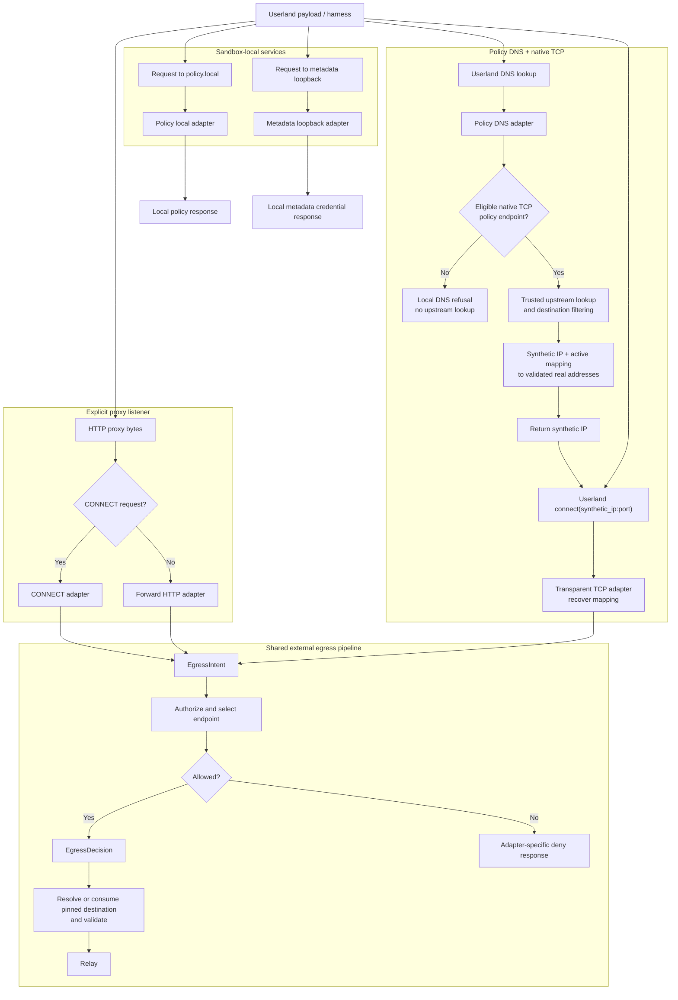
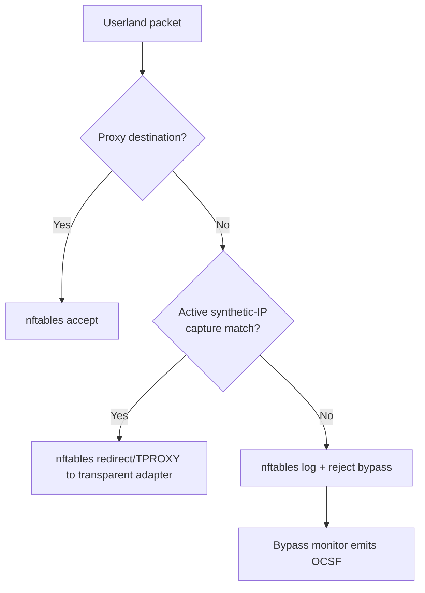

---
authors:
  - "@johntmyers"
state: review
links:
  - https://github.com/NVIDIA/OpenShell/issues/1107
  - https://github.com/NVIDIA/OpenShell/pull/2155
  - https://github.com/NVIDIA/OpenShell/pull/1083
  - https://github.com/NVIDIA/OpenShell/pull/1151
  - https://github.com/NVIDIA/OpenShell/pull/1286
  - https://github.com/NVIDIA/OpenShell/pull/1511
  - https://github.com/NVIDIA/OpenShell/pull/1738
  - https://github.com/NVIDIA/OpenShell/pull/2027
  - https://github.com/NVIDIA/OpenShell/pull/1865
  - https://github.com/NVIDIA/OpenShell/pull/1938
---

# RFC 0005 - Sandbox Proxy Egress Adapter Model

<!--
See rfc/README.md for the full RFC process and state definitions.
-->

## Summary

Refactor sandbox egress around shared authorization, destination-validation,
and relay boundaries. CONNECT, forward HTTP, native TCP capture, policy DNS,
`policy.local`, and metadata loopback become narrow adapters
that translate userland entry points into common runtime intents. Policy
evaluation, destination validation, supervisor middleware, credential
injection, request-body rewrite, WebSocket handling, protocol processing, and
upstream dialing happen behind shared boundaries.

The RFC describes the complete forward-looking architecture. It is designed
to land incrementally across multiple pull requests. The first milestone only
restructures CONNECT and forward HTTP, extracts shared primitives, and
preserves every current user-facing feature and enforcement behavior. Later
milestones add policy DNS, transparent TCP capture, native protocol processors,
and optional deployment shapes on top of those boundaries.

The codebase has already moved in this direction by splitting networking into
`openshell-supervisor-network` and process/netns work into
`openshell-supervisor-process`. This RFC proposes the next internal boundary:
make proxy entry mechanisms pluggable without duplicating authorization,
destination validation, or relay behavior.

Supporting detail lives in:

- [Current shape appendix](current-shape.md)
- [Technical design appendix](technical-design.md)
- [Implementation plan](implementation-plan.md)

## Motivation

The sandbox proxy supports several connection surfaces: explicit CONNECT,
forward HTTP, local inference and policy APIs, metadata loopback, TLS
termination, REST, GraphQL, JSON-RPC, MCP, and WebSocket inspection,
credential injection, supervisor middleware, and nftables-backed bypass
detection. These features are valuable, but changes to policy and enforcement
still tend to touch multiple entry paths.

The risk is asymmetric enforcement. A security fix can be added to CONNECT and
missed in forward HTTP; endpoint metadata can be selected differently from the
logged policy; a credential path can gain request-body or WebSocket support
without the same behavior existing in another relay mode.

The target shape separates three concerns:

- **Adapters** describe how userland reached the networking component.
- **Authorization** decides whether the egress is allowed and what endpoint
  behavior applies.
- **Relays** own bytes, credentials, protocol parsing, and upstream dialing.

The first milestone targets the current embedded/network-only supervisor
runtime and preserves its existing user-facing behavior while the internal
seams move. The same boundaries then support policy DNS and transparent TCP,
native protocol processing, and future deployment modes without duplicating
authorization or relay logic.

## Non-goals

- Replace CONNECT with forward proxy as the only explicit proxy mode.
- Add SOCKS support.
- Add HTTP/2 L7 parsing in this refactor. Inspected HTTP paths should continue
  to reject unsupported h2c upgrades instead of silently upgrading to raw
  traffic.
- Redesign provider credential storage.
- Reintroduce iptables as the sandbox packet filtering backend.
- Use eBPF connect hooks for transparent capture. Native TCP capture needs a
  userland proxy in the byte stream for TLS termination and protocol parsing.
- Add policy-declared supervisor-proxied host-local endpoints. Issue
  [#1633](https://github.com/NVIDIA/OpenShell/issues/1633) can consume these
  boundaries in separate feature work.
- Change the existing endpoint-only runtime's process-identity semantics during
  the compatibility refactor. Future identity-less deployment modes require an
  explicit capability contract and cannot inherit endpoint-only behavior by
  accident.

## Proposal

### Migration Big Rocks

1. **Transport and local-service adapters.** CONNECT, forward HTTP,
   transparent TCP, policy DNS, `policy.local`, and metadata
   loopback become small adapters. They parse their surface and produce either
   an egress intent, a local response, or a DNS answer. They do not duplicate
   policy evaluation.
2. **Egress intent and decision.** Shared authorization evaluates L4 policy and
   endpoint selection once per connection intent and returns one decision
   containing the matched policy, matched endpoint, optional process identity
   evidence used for evaluation, allowed IP metadata, TLS behavior, protocol
   enforcement, and credential injection and middleware plans.
3. **Relays.** Relays receive an authorized destination connector, not an
   already-open upstream socket. HTTP relays evaluate every request before
   upstream write. TCP relays copy bytes for L4-only endpoints or hand the
   stream to a protocol processor when endpoint policy requires native protocol
   enforcement.

The first implementation milestone populates a compatibility
`EgressDecision` through the existing separate queries so type extraction does
not change behavior. That transitional envelope is not the target single
authorization result. Generation-consistent materialization and deterministic
endpoint selection cut over separately after shadow comparison, before later
transport adapters depend on the result.

### Unified Adapter Flow

Each adapter still owns its response shape. If authorization denies a CONNECT
intent, the CONNECT adapter returns a tunnel denial. If forward HTTP is denied,
the forward adapter returns an HTTP denial. If policy DNS refuses a name, it
returns the appropriate DNS response. The shared layer decides the outcome;
the adapter renders it for its protocol.

### Relay Flow

```mermaid
flowchart TD
    Start["Authorized egress + destination connector"]
    Start --> FirstReq{"Forward HTTP adapter<br/>already has first request?"}

    FirstReq -- Yes --> ForwardEnforcement{"Endpoint enforcement"}
    ForwardEnforcement -- "None or HTTP" --> HttpReq["Parsed HTTP request"]
    ForwardEnforcement -- "Protocol processor" --> BadForward["Deny: HTTP request for native protocol endpoint"]

    FirstReq -- No --> Prepare["Prepare readable client stream"]
    Prepare --> TlsPolicy{"TLS handling enabled?"}
    TlsPolicy -- No --> Readable["Client stream"]
    TlsPolicy -- Yes --> Peek["Peek client bytes"]
    Peek --> Tls{"TLS ClientHello?"}
    Tls -- Yes --> Terminate["Shared TLS terminator"]
    Tls -- No --> Readable
    Terminate --> Readable

    Readable --> Enforce{"Endpoint enforcement"}
    Enforce -- "None" --> Sniff{"HTTP request detected?"}
    Sniff -- Yes --> ParseHttp["Parse HTTP request"]
    Sniff -- No --> TcpRelay["TcpRelay<br/>connect upstream and copy bytes"]
    ParseHttp --> HttpReq

    Enforce -- "HTTP" --> MustHttp{"HTTP request detected?"}
    MustHttp -- Yes --> ParseHttp
    MustHttp -- No --> DenyHttp["Deny: expected HTTP"]

    Enforce -- "Protocol processor" --> Processor["TcpRelay hands stream to protocol processor"]
    Processor --> ProcessorOwns["Processor owns message loop<br/>and calls connector when allowed"]

    subgraph HttpLoop["HTTP relay request loop"]
        HttpReq --> HttpMode{"HTTP endpoint policy?"}
        HttpMode -- "L4-only HTTP" --> ReqAllowed["Request admitted by connection decision"]
        HttpMode -- "REST / GraphQL / JSON-RPC / MCP / WebSocket" --> ReqPolicy{"Request policy allowed?"}
        ReqPolicy -- No --> ReqDeny["Local HTTP deny<br/>no upstream write"]
        ReqPolicy -- Yes --> ReqAllowed
        ReqAllowed --> Middleware{"Supervisor middleware<br/>configured?"}
        Middleware -- Yes --> MwEval["Run HTTP_REQUEST / PRE_CREDENTIALS middleware"]
        Middleware -- No --> Creds["Resolve static placeholders<br/>and token grants"]
        MwEval --> MwAllowed{"Middleware allowed?"}
        MwAllowed -- No --> MwDeny["Local middleware deny<br/>no credential injection"]
        MwAllowed -- Yes --> Recheck["Re-parse transformed protocol body<br/>and re-evaluate request policy"]
        Recheck --> PostMwAllowed{"Allowed under endpoint<br/>enforcement mode?"}
        PostMwAllowed -- No --> PostMwDeny["Local policy deny<br/>no credential injection"]
        PostMwAllowed -- Yes --> Creds
        Creds --> Rewrite["Inject credentials into configured slots"]
        Rewrite --> HttpDial["Connect or reuse upstream"]
        HttpDial --> HttpResponse["Write request and relay response"]
        HttpResponse --> Upgrade{"101 WebSocket upgrade?"}
        Upgrade -- No --> NextReq{"Another HTTP request<br/>on this connection?"}
        NextReq -- Yes --> HttpReq
        NextReq -- No --> Done["HTTP relay done"]
        Upgrade -- Yes --> WsInspect{"WebSocket inspection<br/>or rewrite configured?"}
        WsInspect -- No --> RawUpgrade["Raw upgraded stream"]
        WsInspect -- Yes --> WsRelay["WebSocket relay<br/>text-frame rewrite / message policy"]
    end
```

Read this as two phases. The top half chooses the relay shape from the adapter
surface and endpoint enforcement. The `HTTP relay request loop` only receives a
parsed HTTP request. Supervisor middleware is not another policy funnel; it is
an optional request-path hook after HTTP policy allows the request and before
OpenShell-managed credential injection. When middleware changes a request
body, the relay re-parses body-dependent protocol inputs and re-evaluates
request policy before credential injection or upstream write.

Relay rules:

- HTTP credential injection happens in both HTTP modes: L4-only HTTP and
  HTTP-inspected.
- HTTP-inspected endpoints include `rest`, `graphql`, `json-rpc`, `mcp`, and
  `websocket`. JSON-RPC and MCP are HTTP L7 protocols, not native TCP protocol
  processors.
- Supervisor middleware is a typed relay hook. V1 middleware runs on parsed
  HTTP requests at `HTTP_REQUEST / PRE_CREDENTIALS`, after network and request
  policy admit the request and before OpenShell injects credentials.
- Middleware can allow, deny, replace the bounded request body, add approved
  headers, and emit audit-safe findings/metadata. External middleware must not
  receive OpenShell-managed credentials.
- Middleware mutation cannot bypass request policy. After a body replacement,
  the relay re-parses and re-evaluates body-dependent GraphQL, JSON-RPC, and MCP
  policy inputs before credential injection or upstream write. A policy
  mismatch follows the endpoint's configured enforcement mode; a malformed or
  unclassifiable transformed protocol body fails closed even in audit mode.
- Credential injection includes static placeholder rewrite and endpoint-bound
  dynamic token grants. Token grants run after policy allow and before upstream
  write; failures deny without forwarding the request.
- Middleware-transformed content must not create a new path for resolving
  OpenShell credential placeholders unless the middleware hook is explicitly
  trusted as credential-capable. The safe default is to fail closed on newly
  introduced reserved placeholders before credential injection.
- Static credential rewrite covers request target, query, headers, opt-in REST
  request bodies, and opt-in client-to-server WebSocket text frames.
- HTTP L7 policy is evaluated before upstream write for each request. JSON-RPC
  and MCP evaluation parse bounded JSON-RPC-over-HTTP bodies; MCP adds
  tool-aware selectors for `tools/call`.
- WebSocket upgrade policy is evaluated as HTTP first. After an allowed `101`
  upgrade, the WebSocket relay owns frame parsing when text-frame credential
  rewrite, WebSocket transport policy, GraphQL-over-WebSocket policy, or safe
  compression handling is configured. Other upgraded streams remain raw.
- Forward HTTP must stay in the shared HTTP relay loop or in an equivalent
  guarded single-request relay. It must not evaluate one request and then
  switch to raw bidirectional copy.
- `protocol: tcp` or an omitted protocol means L4 authorization plus byte copy,
  except that HTTP-looking streams may still use HTTP credential injection.
- Future native protocol processors, such as Redis, Postgres, or MySQL, own the
  full message loop and can parse multiple commands or queries on one TCP
  session. A processor may be in-tree, middleware-backed, or a combination
  where in-tree framing exposes typed middleware hooks.

### Adapter Responsibilities

CONNECT remains the generic explicit proxy mode for HTTPS and arbitrary TCP.
The CONNECT adapter parses `CONNECT host:port` into an `EgressIntent`, asks the
shared authorization boundary for an `EgressDecision`, returns the tunnel-ready
response only after the connection is allowed, and then hands the tunnel to the
relay. The upstream connection is opened by the HTTP relay or protocol
processor when payload policy allows it. The compatibility milestone preserves
the current raw-relay dial point until the processor boundary exists.

Forward HTTP is compatibility for clients that send absolute-form HTTP
requests. The adapter parses the first request, rewrites proxy framing only at
the relay boundary, rejects `https://` absolute-form requests, rejects
unsupported h2c upgrades on inspected routes, and either stays in a shared HTTP
request loop or forces `Connection: close` for a guarded single request.

Transparent TCP is for native clients that do not know they are using a proxy.
It depends on policy DNS and nftables capture. For a policy-eligible native TCP
name, policy DNS returns a supervisor-owned synthetic IP and creates an active
mapping from that IP to the normalized name, matched endpoint, allowed ports,
and validated real addresses. Userland later calls
`connect(synthetic_ip:port)`, nftables redirects the traffic to a userland
listener, and the TCP adapter recovers the synthetic destination and exact
mapping before building an intent.

Policy DNS replaces static `/etc/hosts` snapshots for native TCP names. It is
query-driven. It first checks whether the normalized name matches an endpoint
whose transport and protocol contract enables native TCP through policy DNS. A
name without such an endpoint receives a local policy-denial DNS response,
normally `REFUSED`, and is never sent to upstream DNS. An eligible name is
resolved through trusted DNS, and every returned address is filtered through
destination and SSRF controls before the adapter atomically publishes the
mapping and capture state and returns the synthetic IP to userland.

The later connect still runs through normal authorization. The connector may
dial only the validated real addresses pinned in the unexpired mapping; it must
not perform an unrelated fresh resolution or treat a direct connection to one
of those real IPs as correlated. Process identity remains independent
authorization evidence evaluated at connect time, not the mechanism that joins
the DNS request to the TCP connection.

Local service adapters stay outside the normal external egress relay:
`policy.local` exposes current policy, denial summaries, proposal submission,
and proposal wait routes; metadata loopback serves provider metadata
credentials to SDKs that bypass HTTP proxy variables.

### Network Enforcement Substrate

Current main uses nftables for sandbox bypass enforcement. It accepts
proxy-bound traffic, loopback, and established flows, then rejects and
optionally logs other TCP/UDP traffic for the bypass monitor. That is current
enforcement, not native TCP capture.

Transparent TCP extends this nftables model with explicit capture rules that
run before the reject path and are scoped to unexpired synthetic-IP mappings.
The sandbox resolver points to policy DNS, while direct external DNS traffic
continues to the reject path. DNS-over-HTTPS is ordinary HTTPS egress and
requires its own allowed endpoint. Transparent capture does not add a parallel
iptables path. The compatibility milestone leaves the current table unchanged;
capture arrives in a later feature phase.

### Deployment Modes

| Mode | Shape | Status |
|------|-------|--------|
| Embedded supervisor | `openshell-sandbox` orchestrates `openshell-supervisor-network` and `openshell-supervisor-process` | Current |
| Network-only supervisor | Networking, policy, proxy, local services, and background tasks run without a payload process leaf | Current runtime mode |
| Standalone proxy binary | Supervisor launches networking as a separate process with explicit APIs | Future packaging/API work |
| Sidecar proxy | Proxy runs outside the payload container but inside the sandbox boundary | Future isolation mode |

A pluggable proxy must expose the right userland surfaces, implement the
gateway APIs it needs, and prove equivalent policy enforcement through tests.
If supervisor middleware is configured, the proxy runtime must also receive the
effective middleware service registry, validate and refresh bindings, enforce
`fail_open` and `fail_closed`, buffer within configured caps, invoke middleware
on the request path, and emit middleware OCSF events.

Process identity is mode-dependent. Embedded supervisor mode normally requires
successful workload process, binary, and ancestor resolution; a lookup failure
continues to deny. A trusted runtime can explicitly select the existing
endpoint-only mode, in which identity is recorded as intentionally unavailable
and policy evaluation keeps its current endpoint-only semantics. The refactor
must not represent either case as a fabricated empty identity or accidentally
convert a lookup failure into endpoint-only evaluation.

Future standalone and sidecar modes must advertise identity capability. A mode
without local identity needs an explicit unavailable-identity contract and
policy validation for binary/path predicates; it does not automatically inherit
endpoint-only semantics. The nftables rules that force, capture, or reject
userland traffic remain owned by the sandbox network boundary even if the proxy
process later moves into a standalone binary or sidecar.

### Migration And Operational Contract

Mechanical adapter, destination, and relay extractions ship as isolated,
revertible changes without a permanent feature flag. The deterministic
authorization result is different: it first runs beside the legacy queries in
shadow mode, reports audit-safe mismatches through internal telemetry, and
retains the legacy evaluator through the cutover observation window.

Policy DNS, transparent TCP, native processors, and alternate deployment modes
land only after the shared authorization and relay contracts are authoritative.
Each is a separate, feature-bearing pull request or series with its own
capability gating, migration, telemetry, and rollback plan; they are not bundled
into the compatibility-only refactor.

Adapter response bytes and OCSF event class, action, disposition, severity,
status, destination, actor, firewall rule, message, and status detail are
compatibility surfaces. Moving code does not justify changing them. Performance
is also measured at each phase; fewer OPA evaluations are a target to verify,
not an unmeasured claim.

## Implementation plan

The detailed migration plan lives in [implementation-plan.md](implementation-plan.md).
The intended order is:

1. Lock down current responses, OCSF events, policy outcomes, credential
   behavior, upstream-dial timing, and local-service behavior with regression
   coverage.
2. Introduce compatibility `EgressIntent` and `EgressDecision` envelopes while
   preserving current lookup precedence and failure defaults.
3. Centralize destination validation behind an unopened connector.
4. Materialize one generation-consistent authorization decision, compare it
   against the legacy queries, then cut over deterministic endpoint selection
   and fail-closed metadata handling as an independently reviewable step.
5. Consolidate HTTP request-loop, credential, WebSocket, and middleware relay
   behavior in separately shippable subphases.
6. Consolidate TLS handling and existing raw TCP relay selection.
7. Preserve current local-service boundaries and remove compatibility plumbing.
8. Add the native protocol-processor dispatch contract, then add protocol
   implementations as independently reviewed features.
9. Add policy DNS state and transparent TCP capture with mandatory
   DNS-answer-to-connect correlation and separate mapping generations.
10. Define capability-checked standalone or sidecar runtime contracts and
    complete cleanup after each boundary is in use.

Steps 1 through 7 are the compatibility foundation and may themselves span
several pull requests. Steps 8 through 10 are later feature milestones; their
presence in this RFC defines the direction without adding them to the initial
refactor branch.

## Risks

- Tightening L7 and TLS metadata failures from fail-open to deny may expose
  latent policy or Rego errors. `allowed_ips` and SSRF validation already fail
  more conservatively; tests must cover each query independently.
- Deterministic endpoint selection may change ambiguous overlapping policies.
  The new decision must shadow the legacy queries and report mismatches before
  any semantic cutover.
- Token grants add a runtime dependency on SPIFFE Workload API and token
  endpoints. Failures should remain fail-closed and sanitized.
- Transparent TCP capture adds network-namespace interception and mutable DNS
  mapping state. Synthetic address allocation must coexist with runtime
  networks, avoid premature reuse, prevent unrelated bare-IP connections from
  inheriting DNS authorization, and fail closed across policy or mapping
  generation changes.
- Sidecar or standalone modes may intentionally lack process identity.
  Binary/path-scoped policy needs an advertised identity capability and policy
  validation; missing identity cannot silently broaden an allow.
- Metadata loopback and `policy.local` expand sandbox-local control surfaces
  and need strict route validation, body limits, redaction, and authentication
  boundaries.
- Provider-composed policy rules use a reserved namespace. Decisions and logs
  must distinguish provider-derived policy from user-authored policy without
  exposing provider rules as editable sandbox proposals.
- Supervisor middleware adds a synchronous request-path dependency. Body caps,
  timeout behavior, registry reloads, and `fail_open` choices must be visible
  in telemetry so operators can diagnose whether content inspection ran.
- Moving OCSF emission sites can accidentally change event class, action,
  disposition, severity, message, or actor/destination fields. Adapter response
  shapes and OCSF schemas are compatibility requirements, not cleanup targets.
- New decision/context objects add per-connection allocations on a hot path.
  Performance claims require before/after measurements of OPA evaluation count,
  allocation volume, and connection/request latency.
- Structural phases back out by reverting their isolated commits. The
  deterministic-decision cutover must retain the legacy evaluator long enough
  for shadow comparison and immediate rollback; a permanent feature flag is not
  required for the purely mechanical phases.

## Alternatives

### Keep patching each entry path

This has the lowest short-term cost but keeps security behavior duplicated
across CONNECT, forward HTTP, and local services. It also makes future TCP
application protocol support harder because each parser must be wired through
multiple entry mechanisms.

### Replace CONNECT with forward proxy

Forward proxy only covers plaintext absolute-form HTTP requests. It is not a
replacement for HTTPS tunnels, WebSocket tunnels, or arbitrary TCP clients.
CONNECT should remain the generic explicit proxy mode.

### Build only transparent TCP

Transparent TCP helps native clients but does not replace explicit proxy
support used by common HTTP tooling. It also requires the shared authorization,
destination, and relay boundaries plus policy DNS and nftables capture before
it can safely preserve endpoint identity. For that reason it is a later phase
of this RFC, not the first implementation change.

### Return real addresses from policy DNS

Returning validated real addresses avoids a synthetic address pool, but the
later TCP connection carries only an IP and port. Two policy names can share
the same real address and port, and a direct bare-IP connection is
indistinguishable from one caused by the earlier lookup. Process identity does
not solve shared resolvers, caches, cross-process handoff, or two names resolved
by the same process. The proposal therefore uses a synthetic address as the
correlation handle and keeps process identity as separate authorization
evidence.

## Prior art

The current `openshell-supervisor-network` split is the immediate prior step:
it already separates proxy, OPA, L7, inference routing, policy-local routes,
TLS, and token grants from process supervision.

The current `openshell-supervisor-process` netns and bypass monitor are the
packet-enforcement substrate. Transparent TCP extends that nftables model in a
later phase rather than creating a second firewall path.

The existing L7 relay is the behavioral prior art for this RFC. It already
proves per-request HTTP evaluation, GraphQL parsing, JSON-RPC/MCP body
inspection, WebSocket frame handling, request-body rewrite, and token-grant
injection can live behind relay boundaries.

RFC 0009 supervisor middleware is the extension prior art. It defines
`HTTP_REQUEST / PRE_CREDENTIALS` as a supervisor-owned hook that can inspect,
deny, or transform admitted HTTP requests before credentials are injected. RFC
0005 should place that hook inside the shared relay rather than making each
adapter wire middleware separately.

## Open questions

1. Should overlapping endpoint metadata be rejected at policy load time, or
   should one documented policy/endpoint precedence key select the complete
   decision? The initial compatibility refactor does not choose between them.
2. What mismatch-free observation window is sufficient before the
   deterministic decision replaces the legacy endpoint queries?
3. Should metadata loopback be modeled as an adapter inside
   `openshell-supervisor-network`, or remain orchestrated by `openshell-sandbox`
   with shared credential/provider helpers?
4. What TTL cap should policy DNS use, and should policy reload immediately
   invalidate all active mappings or permit a bounded drain period that cannot
   authorize new connections?
5. Which non-routable synthetic IPv4 and IPv6 ranges can each runtime reserve,
   and what quarantine period prevents address reuse while stale DNS answers
   may remain cached?
6. Which original-destination mechanism and nftables redirect mode should each
   supported runtime use while keeping capture rules ahead of bypass rejection?
7. Which identity capabilities must standalone and sidecar runtimes advertise
   before the gateway accepts binary/path-scoped policy for them?
