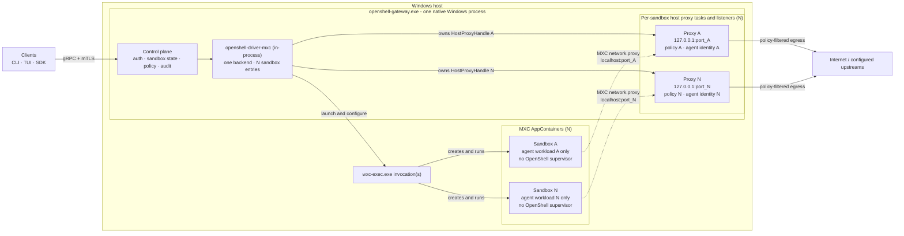
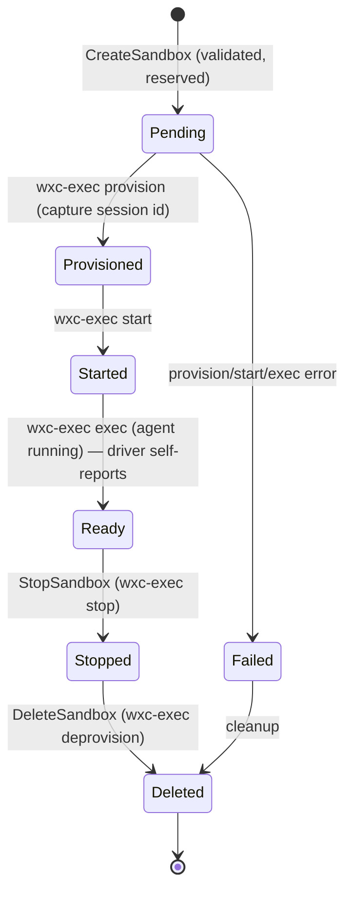

---
authors:
  - "@shailendra-nv"
state: review
links:
  - https://github.com/NVIDIA/OpenShell/issues/2050
  - https://github.com/NVIDIA/OpenShell/pull/2071
---

# RFC 0013 - Native Windows Support via the MXC Compute Driver

<!--
See rfc/README.md for the full RFC process and state definitions.
-->

## Summary

This RFC proposes extending OpenShell to run natively on Windows 11 (x64 and
ARM64) without a Linux VM, Docker Desktop, or WSL. It will produce a new
compute driver, `openshell-driver-mxc`, that will use Microsoft
Execution Containers (MXC, via `wxc-exec.exe`) as the sandbox primitive.

The central architectural conclusion is that OpenShell rejects porting its Linux
in-sandbox supervisor to Windows as part of this design. The value layers the
supervisor delivers on Linux — egress policy enforcement (OPA), L7 HTTP
inspection — are relocated to the host by running OpenShell's existing CONNECT
proxy inside the driver process and pointing MXC's built-in `network.proxy`
redirect at it. The integration therefore collapses to three moving parts: the
native Windows OpenShell gateway, a Windows-only MXC compute driver crate, and an
unmodified `wxc-exec` binary, with no OpenShell binary running inside the
sandbox.

## Motivation

OpenShell sandboxes autonomous AI agents. On Linux it does so through the
Docker, Podman, Kubernetes, and libkrun-VM compute drivers, each pairing a
compute backend with an in-sandbox `openshell-sandbox` supervisor that enforces
policy and runs the agent. None of those drivers give a first-class experience on
Windows: Docker Desktop uses a WSL2-backed VM for Linux containers and adds
licensing and resource overhead, WSL2 adds install and networking complexity, and
Hyper-V/Windows Sandbox are heavy and require elevation. Today a Windows
developer or enterprise host cannot run an OpenShell sandbox without standing up
a Linux runtime underneath it.

Windows is a primary environment for the agents OpenShell targets, particularly
for GeForce and enterprise Windows users. We want native, OS-level isolation
that runs unelevated, with the same policy, inference, and audit guarantees users
get on Linux. Windows 11-Preview Builds now supports MXC (`processcontainer`, backed by
AppContainer + a Low Integrity token) as an OS-native sandbox primitive that
already honors a `network.proxy` egress redirect. That makes a supervisor-free,
host-enforced design feasible without any changes to Microsoft's runtime.

This is worth an RFC rather than a single issue because it is a cross-cutting
architectural decision: it adds a new compute-driver model (in-process,
supervisor-free), a new platform target with its own build/CI lane, a new
policy-translation seam between OpenShell policy and MXC config, and a new
host-side enforcement model for native Windows sandboxes. It also commits
OpenShell to a set of dependencies on the Microsoft MXC team. These decisions
deserve broad review and a durable record.

If we leave the current design unchanged, OpenShell remains Linux-only in
practice, Windows users are pushed toward heavyweight VM-based workarounds, and
the Windows work continues to live outside the public project.

## Non-goals

- Porting `openshell-sandbox` (the Linux supervisor) to Windows, or shipping any
  in-sandbox OpenShell binary. This RFC rejects that path for native Windows.
- Making Windows a Docker, Podman, Kubernetes, or VM runtime host. Those drivers
  remain compile-only configuration stubs that return an unsupported error.
- Starting MXC sandboxes from OCI images or Dockerfiles in the MVP. MXC runs
  against the host Windows OS with policy/configuration, not a separate Linux
  container image.
- Named-pipe driver IPC, a cross-process MXC driver binary, or a tonic
  `ComputeDriverService` adapter for MXC. The driver is in-process.
- Full L7/port/binary-scoped policy enforcement inside MXC itself. MXC network
  filtering is host/IP/CIDR-level; rich policy stays on the host proxy.
- MSI/WinGet packaging, installer UX, auto-start, and background gateway
  management.
- GPU passthrough into MXC sandboxes.
- Changing Linux or macOS build, runtime, or driver behavior. All Windows code is
  gated behind `cfg(target_os = "windows")`.

## Proposal

### Layered architecture

OpenShell on Windows is a four-layer stack with a single hard trust boundary at
the MXC sandbox. For the current scope, the gateway runs as a user-launched
native Windows process. The MXC compute driver and per-sandbox host CONNECT proxy
tasks live inside that process. The agent runs inside an MXC AppContainer with
all egress redirected to its assigned host proxy listener.

The gateway-to-sandbox relationship is 1:N for control and lifecycle, but the
proxy-listener-to-sandbox relationship is 1:1. Each sandbox registry entry owns
one `HostProxyHandle`, one sandbox-specific policy, and one unique ephemeral
loopback listener. The listener identifies the sandbox without attributing
connections arriving on a shared proxy port.

The defining property is that OpenShell network enforcement lives on the host
inside the gateway process, not inside the sandbox. The current host-mode path
provides L4 policy and plaintext/forward-proxy L7 handling. HTTPS MITM trust
bootstrap, inference/privacy routing, and gateway event-bus wiring remain
follow-up work.

This still allows the existing supervisor networking code to be reused as a
host-side proxy component. The boundary is that Windows does not run
`ConnectSupervisor`, a sandbox relay, or any OpenShell process inside the MXC
sandbox.

### Part 1 - Native Windows build

This effort compiles the gateway and CLI for
`x86_64-pc-windows-msvc` and `aarch64-pc-windows-msvc` while keeping Linux and
macOS unchanged. The dominant change is a consistent cfg-gating pattern: each
crate whose implementation is Unix-specific moves its Unix body into a
`*_unix.rs` module and adds a small `windows.rs` (or stub), preserving public
library entry points and configuration structs on both platforms.

- Unsupported drivers (Docker, Podman, Kubernetes, VM) become compile-only
  configuration stubs. The gateway still parses existing config files for every
  driver name and returns a clear unsupported error at gateway construction
  (Docker/Kubernetes/Podman) or at spawn (VM), never a parse failure or silent
  no-op.
- `openshell-core/build.rs` selects a vendored `protoc` per platform
  (`protoc-bin-vendored` on Windows, `protobuf-src` elsewhere) so proto
  compilation succeeds under MSVC.
- Windows path defaults resolve configuration under `%APPDATA%` and state/data
  under `%LOCALAPPDATA%`.
- Validation runs through a dedicated `mise` lane (`tasks/windows.toml` →
  `tasks/scripts/windows-msvc.ps1`) invoked as `mise run --skip-tools windows:*`,
  separate from the default Linux `ci` task. The wrapper discovers Visual
  Studio's `VsDevCmd.bat`, adds rustup MSVC targets, and clears inherited
  `RUSTC_WRAPPER`.
- A `windows-msvc` GitHub Actions job runs x64 check/build/test plus the
  unsupported-driver contract tests on `windows-2025`; ARM64 is scaffolded and
  disabled until an ARM64 runner is available.

The Windows build target intentionally includes both `openshell.exe` and
`openshell-gateway.exe`. Running the gateway only as a Linux container while a
remote Windows MXC driver manages native sandboxes would keep the main repo's
Windows target smaller, but it would reintroduce a Linux container/VM dependency
and does not meet the native, low-overhead client-system goal of this RFC.

### Part 2 - The MXC compute driver

`openshell-driver-mxc` is a library crate entirely behind
`cfg(target_os = "windows")` (an empty shell elsewhere). It is linked
in-process into `openshell-server` and implements a plain Rust `ComputeBackend`
trait — there is no separate binary, no surrogate, and no tonic adapter.

| Module | Responsibility |
|---|---|
| `driver.rs` (`MxcComputeBackend`) | Orchestrator: owns the registry, validates specs, runs the lifecycle, drives `wxc-exec` phases, runs the agent, resolves provider credentials (Windows Credential Manager) and injects them, self-reports readiness, emits watch events. |
| registry | In-memory `Arc<Mutex<…>>` mapping OpenShell sandbox id/name ⇄ MXC session id + phase state + exec/PTY handles. Source of truth for Get/List/Watch (MXC has no list-sessions API). |
| `mxc.rs` | Builds MXC config JSON, base64-encodes it, runs `wxc-exec`, parses envelopes; encapsulates exec-vs-non-exec stdout semantics and error-code mapping. |
| `policy.rs` | Translates the `SandboxPolicy` proto → MXC config and rejects unenforceable rules. Delegates to the embedded policy mapper (see Part 3). |
| `openshell-supervisor-network::host` | Starts one host CONNECT proxy task per sandbox on a unique `127.0.0.1:<ephemeral-port>` listener, applies that sandbox's trimmed network policy and static agent identity, and retains its `HostProxyHandle` in the driver registry. |

#### Workload and software availability

MXC does not consume the OCI image model used by Linux container runtimes. For current support, the sandbox runs Windows
software already present on the host or made available through explicit MXC
filesystem grants, with the driver supplying the agent command, working
directory, environment, credentials, and policy-derived MXC configuration.

That is different from Linux, where a sandbox image can carry a separate userland
and dependency set. The MXC `processcontainer` and AppContainer paths share the
host Windows OS; the policy/configuration creates the isolation boundary. If MXC
later grows a Windows VM-backed image model, OpenShell can add a separate
bootstrap/image workflow for that backend.

#### The `wxc-exec` interface contract

The `mxc.rs` invoker is the boundary to MXC. Invocation is always
`wxc-exec.exe --config-base64 <base64(JSON)> --experimental [--debug]`;
`configurationId` defaults to `composable` (never `small` — a known OS bug). The
invoker must branch on phase for I/O semantics:

| Phase(s) | stdout | Exit code | Parse as |
|---|---|---|---|
| `provision` / `start` / `stop` / `deprovision` | single JSON envelope `{"result":…}` or `{"error":…}` | 0 success / 1 error | JSON envelope |
| `exec` | live process output (not JSON) | the script's exit code | raw bytes / stream |

`provision` returns the session id to capture. MXC `error.code` values
(`not_provisioned`, `already_started`, `policy_validation`,
`backend_unavailable`, …) map to typed errors. A non-zero `exec` exit is the
script's result, not a driver error.

#### State model and lifecycle

MXC has no remote inventory API, so the in-memory registry is the single source
of truth.

`Ready` is self-reported once the agent launches; it does not depend on any
supervisor connection. Every transition emits a `WatchSandboxes` event.
`CreateSandbox` translates policy → MXC config, resolves and injects credentials,
then runs `provision → start → exec`. Live `connect`/`exec` spawns a fresh
`wxc-exec phase=exec` in a ConPTY and bridges the gateway's bidi stream to its
stdin/stdout — no `ConnectSupervisor`, no in-sandbox SSH server, no relay socket.

There is currently no reconciliation loop in the MVP. If an operator deletes an
OpenShell-managed MXC/AppContainer resource outside OpenShell, `get`, `list`, and
`watch` will continue to reflect the driver's registry until a later operation
touches the missing MXC resource and can mark the sandbox failed or not found.
Durable reconciliation is follow-up work: persist the OpenShell sandbox id ⇄ MXC
session id mapping in SQLite, probe or deprovision known sessions on startup, and
add a periodic reconcile loop when MXC exposes a list/inspect API.

#### Governed egress

Governed egress is the core value layer. When it is enabled,
`egress_proxy_addr` serves as a loopback address seed. For each sandbox, the MXC
driver preserves the configured IP and binds port `0` to allocate a fresh
ephemeral port. It starts the existing OpenShell host CONNECT proxy with that
sandbox's trimmed network-only policy, then writes the allocated port to MXC's
`network.proxy = { localhost: N }` redirect. Loopback inside an AppContainer is
host loopback, so sandbox egress reaches the proxy running in the in-process MXC
driver inside the gateway process.

The host-listener-to-sandbox topology is **1:1**, not many-to-one. Multiple
sandboxes share `127.0.0.1`, but each active sandbox owns a unique ephemeral port
and host proxy handle in the driver registry. The resulting
`127.0.0.1:<port>` tuple scopes every inbound proxy connection to exactly one
sandbox, eliminating the need to infer sandbox identity from shared loopback
traffic. Dropping the handle when the sandbox stops, exits, or fails terminates
that sandbox's proxy accept loop.

Because MXC does not expose Linux procfs socket ownership, the proxy evaluates
each connection against the listener's sandbox policy and a static sandbox-agent
identity derived from the configured `agent_command`. The current host-mode path
evaluates L4 host:port allow/deny via OPA, handles plaintext and forward-proxy L7
traffic, and emits OCSF events. HTTPS MITM trust bootstrap and gateway
denial/activity bus wiring remain follow-up work. The default `processcontainer`
backend already honors `network.proxy`, so this design requires no MXC changes.

### Part 3 - Policy translation between OpenShell and MXC

OpenShell policy is authored as YAML and parsed to the `SandboxPolicy` proto by
the shared cross-platform `openshell-policy` crate. The MXC driver does not
re-parse YAML; a dedicated Rust policy mapper (embedded in the driver and called
automatically) maps the proto IR to MXC `ContainerConfig` and **rejects rather
than silently drops** anything MXC cannot enforce. MXC imposes a provision-time
vs exec-time split.

| OpenShell policy | Where enforced | MXC mapping | When |
|---|---|---|---|
| filesystem read/write paths | MXC | `filesystem.readwritePaths` | provision |
| filesystem read-only paths | MXC | `filesystem.readonlyPaths` | provision |
| filesystem denied paths | MXC | limited / unsupported | provision |
| process (uid/gid/seccomp) | — (no analog) | reject (default) | — |
| network (OPA / L7 / inference / privacy) | host CONNECT proxy | `network.proxy = { localhost: N }` redirect | provision |

The primary governed-egress design does **not** try to map the full OpenShell
network policy into MXC network policy. MXC receives a fail-closed redirect
layer: `network.defaultPolicy = "block"`, empty direct allowlists, and
`network.proxy = { localhost: N }`. The original OpenShell `network_policies`
are preserved and handed to the host CONNECT proxy, which remains responsible
for ports, binaries, L7 rules, privacy routing, and audit.

The coarse MXC-only mapper is a separate fallback and analysis path for cases
where no proxy is in the loop. In that mode, MXC can roughly express literal
host/IP/CIDR allowlists, but it cannot encode ports, protocols, per-binary scope,
TLS inspection behavior, credential rewrite, inference routing, or REST,
WebSocket, and GraphQL rules. The mapper emits a structured loss report and
rejects error-severity losses rather than silently broadening access. Critically,
MXC defaults to `defaultPolicy: "allow"` when the network block is omitted, so
both paths must explicitly emit `network.defaultPolicy: "block"`.

Across the five OpenShell example policies, the MXC-only coarse mapping is
schema-valid but lossy: an aggregate of 64 access-broadening errors, 32
warnings, and 4 info items. The dominant gaps are binary-scoped network policy,
port-scoped outbound policy, protocol-aware (REST/WebSocket/GraphQL) policy, and
access presets. Those losses do not apply to the governed-egress split because
the host CONNECT proxy receives and enforces the original OpenShell network
policy.

To consume OpenShell policy more faithfully over time, MXC would need
kernel-enforceable additions such as port-scoped network endpoints, a filesystem
`defaultPolicy`, per-process/binary network scoping, and DNS/wildcard handling. A
proposed two-surface direction for Microsoft keeps `ContainerConfig` as the
execution manifest (add portable kernel-enforceable fields such as ports and
filesystem `defaultPolicy`) and adds a separate `policyProxy` surface for L7 and
dynamic policy so HTTP/WebSocket/GraphQL parsing, credential rewrite, audit, and
hot-reload stay out of every backend runner. None of these are required for the
host-enforced design proposed here; they are enhancements that would deepen
kernel-level defense-in-depth.

### Design decisions (D1–D4)

- **D1 — MXC as the Windows sandbox primitive**, over Docker Desktop, WSL2, and
  Windows Sandbox/Hyper-V. MXC is OS-native, needs no VM, and runs unelevated.
  Default backend `processcontainer`; `isolation_session` opt-in. Requires
  Windows 11 build ≥ 26100 and `wxc-exec.exe` present.
- **D2 — Reject porting the supervisor for native Windows.** Use a host proxy +
  MXC `network.proxy` redirect for governed egress, plus driver-owned host-side
  behavior for credentials and exec. No in-sandbox OpenShell binary is part of
  this RFC. Consequence: governed egress on the opt-in `isolation_session`
  backend depends on Microsoft extending `network.proxy` to that backend; until
  then the design defaults to `processcontainer`, where it works today.
- **D3 — User-launched native Windows gateway for the current scope.** Run
  `openshell-gateway.exe` as a regular user process. Clients connect over gRPC
  (loopback or remote mTLS), and existing per-user configuration and state paths
  remain in effect. Installation, auto-start, background process management,
  and Windows Event Log integration are outside this RFC.
- **D4 — Reduce the gRPC footprint to the client-facing API only.** Supervisor
  removal deletes the supervisor and sandbox-relay boundaries; in-process MXC
  removes the wire protocol on the gateway↔driver boundary. Only client↔gateway
  gRPC survives on Windows.

## Implementation plan

All Windows code is gated behind `cfg(target_os = "windows")`, so Linux and macOS
are never affected and the changes can land additively.

- **Compile.** Land the MSVC cfg-gating, per-platform `protoc` selection,
  Windows path defaults, the `mise` Windows lane, and the `windows-msvc` CI job.
  Unsupported drivers become contract stubs with tests asserting they return
  unsupported.
- **MXC driver and host proxy.** Add `openshell-driver-mxc` driving the default
  `processcontainer` backend: lifecycle, policy translation, one host CONNECT
  proxy listener per sandbox, credential injection, and interactive exec via
  the driver's ConPTY bridge. Unenforceable policy is rejected in
  `ValidateSandboxCreate` with `invalid_argument` naming the rule. HTTPS MITM,
  inference/privacy routing, and gateway event-bus wiring follow after host-mode
  trust bootstrap is available.
- **Gateway runtime.** Run `openshell-gateway.exe` directly as a regular user
  process with the existing per-user configuration, SQLite, TLS, and logging
  paths. Installation, auto-start, and background process management are
  follow-up work.
- **Hardening.** Validate collision-free per-sandbox ephemeral port allocation
  and `processcontainer` concurrency. Persist the sandbox-id ⇄ session-id
  mapping so a gateway restart can reconcile or clean up orphaned sessions, and
  add a periodic reconcile loop once MXC exposes a list/inspect API.
- **Opt-in `isolation_session` egress.** Becomes available if and when Microsoft
  extends `network.proxy` to that backend; the same host proxy then governs its
  egress.

Validation follows a layered pyramid: pure-Rust unit tests for the JSON
builders/parsers and policy mapper (on the Windows MSVC test lane), a mock
`wxc-exec` shim (`OPENSHELL_MXC_MOCK_WXC=1`) for lifecycle logic, egress-proxy
component tests for redirect → listener-scoped policy → OPA decision, gated
integration tests against a real `wxc-exec` (`#[ignore]` unless present), and
manual E2E on a real Windows 11 host. User-facing configuration is documented in
the gateway config reference and the architecture docs.

## Risks

| Risk | Mitigation |
|---|---|
| MXC `allowedHosts`/`blockedHosts` not enforced on Windows yet, so there is no kernel-level defense-in-depth beneath the host proxy. | Rely on the host proxy for host-level allow/deny |
| Per-sandbox proxy routing must remain collision-free when multiple sandboxes run concurrently. | Bind a fresh ephemeral port on `127.0.0.1` for each sandbox and retain its proxy handle in the driver registry, making the listener-to-sandbox mapping 1:1. |
| `--config-base64` carries credentials in argv (briefly visible in process listings). | Zero-fill after invocation; prefer passing config on stdin. |
| Concurrency: `isolation_session` is single-session; `processcontainer` limits are unverified. | Validate `processcontainer` concurrency and document any cap. |
| OCSF fidelity: with no in-sandbox supervisor, arbitrary in-process events are not visible (only network + lifecycle). | Accept reduced fidelity; an ETW/callback hook from the Microsoft MXC team will help restore in-process visibility later. |
| Restart and external deletion: the registry is in-memory, so a gateway restart or out-of-band MXC deletion is not immediately reflected in OpenShell state. | Persist the sandbox-id ⇄ session-id mapping in SQLite, reconcile or deprovision orphans on startup, and add periodic reconcile when MXC exposes list/inspect. |
| Policy fidelity: MXC cannot enforce port/binary/L7 policy, so the MXC-only tier is a coarse approximation. | Fail-safe mapper (always `block`, never silently broaden) + host proxy as the real enforcer + a published loss report. |
| Microsoft dependency: several deepening improvements are outside OpenShell's control. | Ship the host-enforced design with no MXC changes required; treat MXC enhancements as optional, not blockers. |

## Alternatives Considered

- **Run OpenShell on Windows via Docker Desktop, WSL2, or Hyper-V/Windows
  Sandbox.** Reuses the existing Linux drivers unchanged, but reintroduces a
  Linux VM, heavier install/network complexity, licensing constraints, and (for
  Hyper-V/Windows Sandbox) elevation. It defeats the goal of OS-native,
  unelevated Windows isolation.
- **Port `openshell-sandbox` to Windows (in-sandbox supervisor).** Maximizes
  Linux parity and defense-in-depth, but requires Windows analogs of
  Landlock/seccomp/netns, a Windows relay protocol, and an in-sandbox binary —
  far more surface for the same user-visible feature set, which the host-proxy
  design already delivers. This RFC rejects that path; any future
  defense-in-depth revisit should be a new design rather than assumed follow-up
  work.
- **Out-of-tree remote MXC driver with a containerized Linux gateway.** This
  would reduce the main repo's Windows build surface to the CLI if the gateway
  could stay containerized. It does not meet this RFC's native Windows goal:
  the MXC driver needs Windows-host access to `wxc-exec`, AppContainer/MXC
  state, loopback proxy routing, and Windows credentials, while a Linux
  containerized gateway would reintroduce the VM/container dependency this RFC
  is removing. It would also require extending the remote driver protocol to
  carry policy and proxy state that the current in-process design can share
  directly.
- **Cross-compile the Windows binaries from Linux only.** Cheaper CI, but cannot
  validate runtime correctness on real Windows hardware, which is essential for
  MXC integration.
- **A cross-process MXC driver binary (like the VM driver) with a tonic
  adapter.** Matches the existing VM driver shape, but adds a wire protocol and a
  second process for no benefit when the driver can be linked in-process and the
  supervisor is gone.
- **Do nothing.** OpenShell stays Linux-only in practice and Windows users rely
  on VM-based workarounds.

## Prior art

- **OpenShell's existing compute drivers** (Docker, Podman, Kubernetes, VM)
  establish the `ComputeDriver`/`ComputeBackend` contract and the
  driver-selection model this RFC extends with an in-process, supervisor-free
  variant.
- **RFC 0001 (core architecture)** and `architecture/sandbox.md` define the
  supervisor/relay model that the Windows design deliberately removes.
- **Microsoft MXC (`wxc-exec`)** provides the Windows AppContainer-based
  sandbox primitive and the `network.proxy` redirect that makes host-side
  enforcement possible without an in-sandbox agent.
- **Open Policy Agent and OpenShell's CONNECT proxy / L7 / inference / privacy
  stack** are reused unchanged on the host, demonstrating that the value layers
  are already cross-platform Rust.
